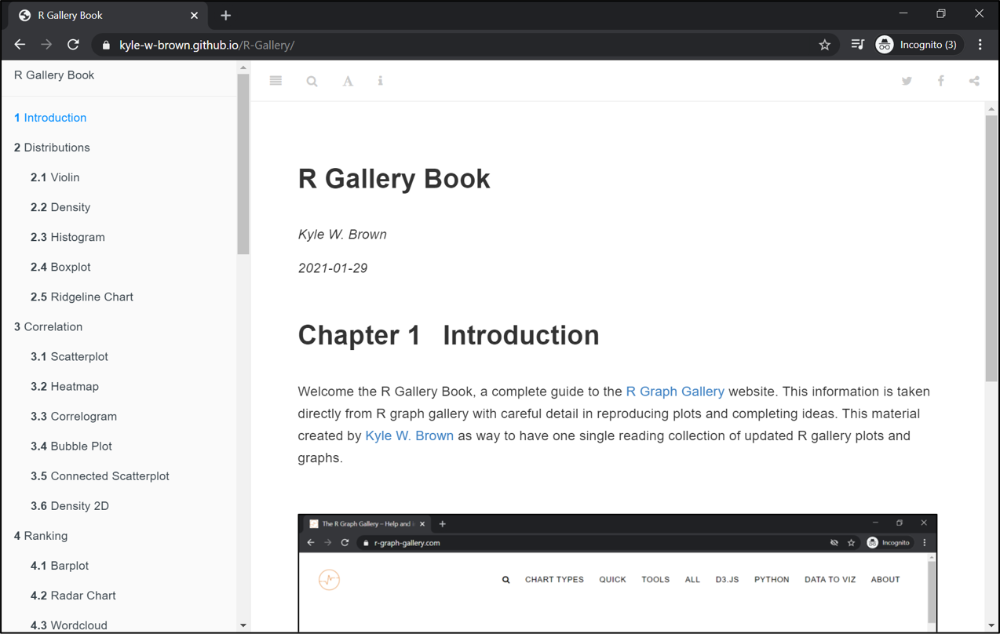
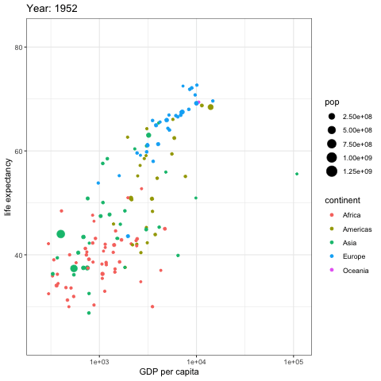

# R-Gallery


  
Welcome to the R Gallery Book, a complete guide to the [R Graph Gallery](https://www.r-graph-gallery.com/) website. This book is taken directly from R Gallery with careful detail in reproducing plots and completing ideas. This is a collection of plots, graphs, diagrams, etc., using R programming language and was combined into one single reading collection of updated R gallery plots and graphs.  


## **Check out the book [here](https://kyle-w-brown.github.io/R-Gallery/)**

<br>

<p align="center"> 

</p>


  
While this book was created to encapsulate the entire [R Graph Gallery](https://www.r-graph-gallery.com/) website into one readable source, another purpose is serving as introductory level into data science visualization using [R programming language](https://www.r-project.org/about.html).


## Note: The book is rather large and may take time to load completely

<br>

```r
# Get data:
library(gapminder)
 
# Charge libraries:
library(ggplot2)
library(gganimate)
 
# Make a ggplot, but add frame=year: one image per year
ggplot(gapminder, aes(gdpPercap, lifeExp, size = pop, color = continent)) +
  geom_point() +
  scale_x_log10() +
  theme_bw() +
  # gganimate specific bits:
  labs(title = 'Year: {frame_time}', x = 'GDP per capita', y = 'life expectancy') +
  transition_time(year) +
  ease_aes('linear')
# Save at gif:
anim_save("271-ggplot2-animated-gif-chart-with-gganimate1.gif")
```



{width=75%}

# Distributions

## Density Plot

### Custom with `theme_ipsum`

The `hrbrthemes` package offer a set of pre-built themes for your charts. I am personnaly a big fan of the `theme_ipsum`: easy to use and makes your chart look more professional:

```r
# Libraries
library(ggplot2)
library(dplyr)
library(hrbrthemes)
# Load dataset from github
data <- read.table("https://raw.githubusercontent.com/holtzy/data_to_viz/master/Example_dataset/1_OneNum.csv", header=TRUE)
# Make the histogram
data %>%
  filter( price<300 ) %>%
  ggplot( aes(x=price)) +
    geom_density(fill="#69b3a2", color="#e9ecef", alpha=0.8) +
    ggtitle("Night price distribution of Airbnb appartements") +
    theme_ipsum()
```

<p align="center"> 

</p>

Here is an example with [another dataset](https://www.data-to-viz.com/story/OneNumOneCatSeveralObs.html) where it works much better. Groups have very distinct distribution, it is easy to spot them even if on the same chart. Note that it is much better to add group name next to their distribution instead of having a legend beside the chart.

```r 
# Load dataset from github
data <- read.table("https://raw.githubusercontent.com/zonination/perceptions/master/probly.csv", header=TRUE, sep=",")
data <- data %>%
  gather(key="text", value="value") %>%
  mutate(text = gsub("\\.", " ",text)) %>%
  mutate(value = round(as.numeric(value),0))
# A dataframe for annotations
annot <- data.frame(
  text = c("Almost No Chance", "About Even", "Probable", "Almost Certainly"),
  x = c(5, 53, 65, 79),
  y = c(0.15, 0.4, 0.06, 0.1)
)
# Plot
data %>%
  filter(text %in% c("Almost No Chance", "About Even", "Probable", "Almost Certainly")) %>%
  ggplot( aes(x=value, color=text, fill=text)) +
    geom_density(alpha=0.6) +
    scale_fill_viridis(discrete=TRUE) +
    scale_color_viridis(discrete=TRUE) +
    geom_text( data=annot, aes(x=x, y=y, label=text, color=text), hjust=0, size=4.5) +
    theme_ipsum() +
    theme(
      legend.position="none"
    ) +
    ylab("") +
    xlab("Assigned Probability (%)")
```

<p align="center"> 

</p>

<br>

## Histogram

### Histogram with Several Groups - `ggplot2`

A [histogram](https://www.data-to-viz.com/graph/histogram.html) displays the distribution of a numeric variable. A common task is to compare this distribution through several groups. This document explains how to do so using R and [ggplot2](https://www.r-graph-gallery.com/ggplot2-package.html).

#### Several Histograms on the Same Axis

If the number of group or variable you have is relatively low, you can display all of them on the same axis, using a bit of transparency to make sure you do not hide any data.

<u>Note</u>: with 2 groups, you can also build a [mirror histogram](https://www.r-graph-gallery.com/density_mirror_ggplot2.html)

```r
# library
library(ggplot2)
library(dplyr)
library(hrbrthemes)
# Build dataset with different distributions
data <- data.frame(
  type = c( rep("variable 1", 1000), rep("variable 2", 1000) ),
  value = c( rnorm(1000), rnorm(1000, mean=4) )
)
# Represent it
p <- data %>%
  ggplot( aes(x=value, fill=type)) +
    geom_histogram( color="#e9ecef", alpha=0.6, position = 'identity') +
    scale_fill_manual(values=c("#69b3a2", "#404080")) +
    theme_ipsum() +
    labs(fill="")
p
```

<p align="center"> 

</p>

<br>

### Boxplot on top of Histogram

This example illustrates how to split the plotting window in base R thanks to the `layout function`. Contrary to the `par(mfrow=...)` solution, `layout()` allows greater control of panel parts.

Here a [boxplot](https://www.r-graph-gallery.com/boxplot.html) is added on top of the [histogram](https://www.r-graph-gallery.com/histogram.html), allowing to quickly observe summary statistics of the distribution.

```r
# Create data 
my_variable=c(rnorm(1000 , 0 , 2) , rnorm(1000 , 9 , 2))
 
# Layout to split the screen
layout(mat = matrix(c(1,2),2,1, byrow=TRUE),  height = c(1,8))
 
# Draw the boxplot and the histogram 
par(mar=c(0, 3.1, 1.1, 2.1))
boxplot(my_variable , horizontal=TRUE , ylim=c(-10,20), xaxt="n" , col=rgb(0.8,0.8,0,0.5) , frame=F)
par(mar=c(4, 3.1, 1.1, 2.1))
hist(my_variable , breaks=40 , col=rgb(0.2,0.8,0.5,0.5) , border=F , main="" , xlab="value of the variable", xlim=c(-10,20))
```

<p align="center"> 

</p>

<br>

## Violin Plot

### Method 1: the `forcats` library

The [Forecats library](https://github.com/tidyverse/forcats) is a library from the `tidyverse` especially made to handle factors in R. It provides a suite of useful tools that solve common problems with factors. `The fact_reorder()` function allows to reorder the factor. The `fact_reorder()` function allows to reorder the factor (`data$name` for example) following the value of another column (`data$val` here).

```{r, echo=TRUE, message=FALSE, warning=FALSE}
# load the library
library(forcats)
# Reorder following the value of another column:
data %>%
  mutate(name = fct_reorder(name, val)) %>%
  ggplot( aes(x=name, y=val)) +
  geom_bar(stat="identity", fill="#f68060", alpha=.6, width=.4) +
  coord_flip() +
  xlab("") +
  theme_bw()
```

<p align="center"> 

</p>

<br>
