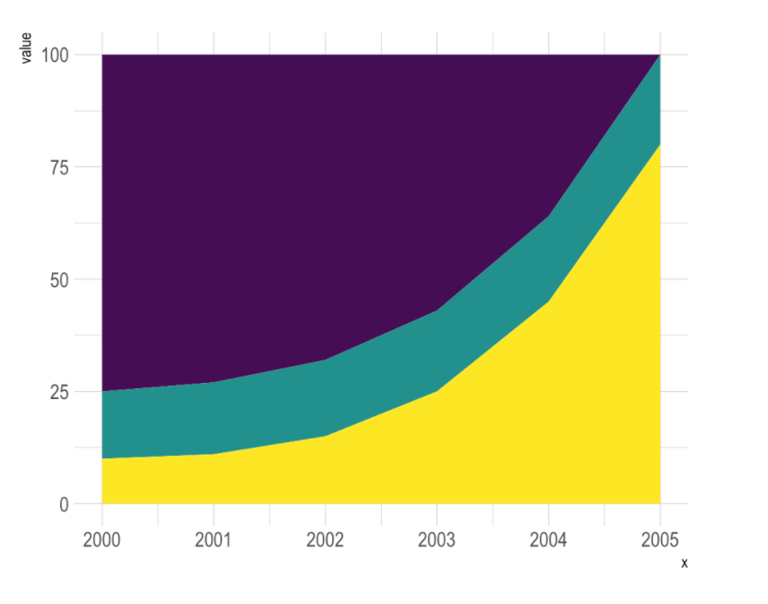
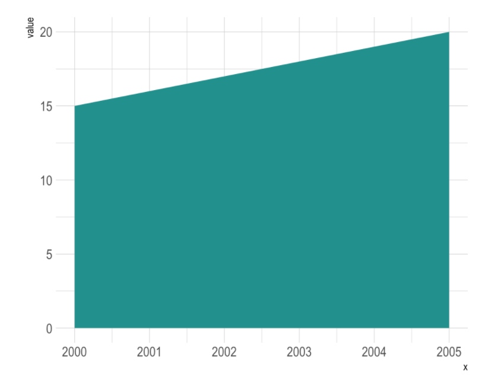
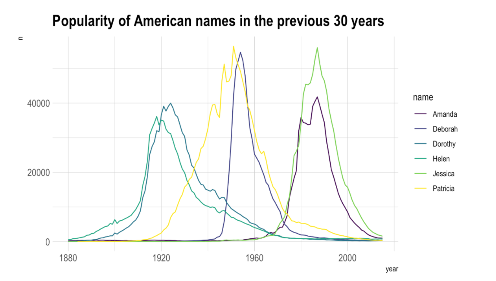
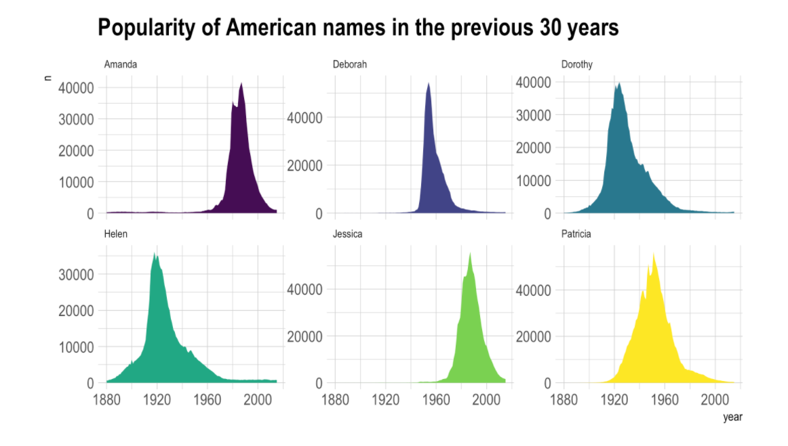

# R-Gallery

<p align="center"> 

</p>

Welcome to the R Gallery Book, a complete guide to the [R Graph Gallery](https://www.r-graph-gallery.com/) website. This book is taken directly from R Gallery with careful detail in reproducing plots and completing ideas. This is a collection of plots, graphs, diagrams, etc., using R programming language and was combined into one single reading collection of updated R gallery plots and graphs.  


## **Check out the book [here](https://kyle-w-brown.github.io/R-Gallery/)**

<br>

<p align="center"> 

</p>


  
While this book was created to encapsulate the entire [R Graph Gallery](https://www.r-graph-gallery.com/) website into one readable source, another purpose is serving as introductory level into data science visualization using [R programming language](https://www.r-project.org/about.html).


## General Knowledge Chapter 

### Table of Contents
* [Animation](#animation)
* [Data Art](#data-art)
* [`ggplot2`](#general-knowledge)


<br>

# Animation

An animated chart displays several chart states one after the other.

It must not be confounded with an [interactive chart](https://www.r-graph-gallery.com/interactive-charts.html) that allows interaction like zooming or hovering.
This section describes 2 methods to build animations with `R`.

The first method builds many png images and concatenate them in a gif using image magick. The second relies on the `gganimate` package
that automatically builds the animation for you.

Here is a great [interactive course](https://www.datacamp.com/courses/data-visualization-with-ggplot2-part-3?tap_a=5644-dce66f&tap_s=230804-f65650) that helps getting started with animations.

#### Build-Animation Directly with `gganimate`

The [gganimate library](https://github.com/thomasp85/gganimate) is a ggplot2 extension that allows to easily create animation from your data. Basically it allows to provide a frame (the step in the animation) as another aesthetic. Note that [this course](https://www.datacamp.com/courses/data-visualization-with-ggplot2-part-3?tap_a=5644-dce66f&tap_s=230804-f65650) is dedicated to it.


### Animated Bubble Chart with R and `gganimate`
 
The `gganimate` package allows to build `animated` chart using the `ggplot2` syntax directly from R. This section shows how to apply it on a [bubble](https://www.r-graph-gallery.com/bubble-chart.html) chart, to show an evolution in time.

### Animated Bubble Chart

Before trying to build an [animated](https://www.r-graph-gallery.com/animation.html) plot with `gganimate`, make sure you understood how to build a [basic bubble chart](https://www.r-graph-gallery.com/bubble-chart.html) with R and `ggplot2`.

The idea is to add an additional aesthetics called `transition_..()` that provides a frame variable. For each value of the variable, a step on the chart will be drawn. Here, `transition_time()` is used since the frame variable is numeric.

Note that the `gganimate` automatically performs a transition between state. Several options are available, set using the `ease_aes()` function.

```r
# Get data:
library(gapminder)
 
# Charge libraries:
library(ggplot2)
library(gganimate)
 
# Make a ggplot, but add frame=year: one image per year
ggplot(gapminder, aes(gdpPercap, lifeExp, size = pop, color = continent)) +
  geom_point() +
  scale_x_log10() +
  theme_bw() +
  # gganimate specific bits:
  labs(title = 'Year: {frame_time}', x = 'GDP per capita', y = 'life expectancy') +
  transition_time(year) +
  ease_aes('linear')

# Save at gif:
anim_save("271-ggplot2-animated-gif-chart-with-gganimate1.gif")
```

<p align="center"> 

</p>


### Use Small Multiple

Since `gganimate` is a ggplot2 extension, any ggplot2 option can be used to customize the chart. Here, an example using `facet_wrap()` to use small multiple on the previous chart, spliting the chart window per continent.

<u>Important note</u>: this example comes from the [gganimate homepage](https://github.com/thomasp85/gganimate).


```r
# Get data:
library(gapminder)
 
# Charge libraries:
library(ggplot2)
library(gganimate)
 
# Make a ggplot, but add frame=year: one image per year
ggplot(gapminder, aes(gdpPercap, lifeExp, size = pop, colour = country)) +
  geom_point(alpha = 0.7, show.legend = FALSE) +
  scale_colour_manual(values = country_colors) +
  scale_size(range = c(2, 12)) +
  scale_x_log10() +
  facet_wrap(~continent) +
  # Here comes the gganimate specific bits
  labs(title = 'Year: {frame_time}', x = 'GDP per capita', y = 'life expectancy') +
  transition_time(year) +
  ease_aes('linear')

# Save at gif:
anim_save("271-ggplot2-animated-gif-chart-with-gganimate2.gif")
```

<p align="center"> 

</p>

### Smooth Barplot Transition

Before trying to build an [animated](https://www.r-graph-gallery.com/animation.html) plot with `gganimate`, make sure you understood how to build a [basic bar chart](https://www.r-graph-gallery.com/barplot.html) with R and  `ggplot2`.

The idea is to add an additional aesthetics called `transition_..()` that provides a frame variable. For each value of the variable, a step on the chart will be drawn. Here, transition_states() is used since the frame variable is categorical.

Note that the `gganimate` automatically performs a transition between state. Several options are available, set using the `ease_aes()` function.

```r
# libraries:
library(ggplot2)
library(gganimate)
 
# Make 2 basic states and concatenate them:
a <- data.frame(group=c("A","B","C"), values=c(3,2,4), frame=rep('a',3))
b <- data.frame(group=c("A","B","C"), values=c(5,3,7), frame=rep('b',3))
data <- rbind(a,b)  
 
# Basic barplot:
ggplot(a, aes(x=group, y=values, fill=group)) + 
  geom_bar(stat='identity')
 
# Make a ggplot, but add frame=year: one image per year
ggplot(data, aes(x=group, y=values, fill=group)) + 
  geom_bar(stat='identity') +
  theme_bw() +
  # gganimate specific bits:
  transition_states(
    frame,
    transition_length = 2,
    state_length = 1
  ) +
  ease_aes('sine-in-out')

# Save at gif:
anim_save("288-animated-barplot-transition.gif")
```

<p align="center"> 

</p>


### Progressive Line Chart Rendering

```r
# libraries:
library(ggplot2)
library(gganimate)
library(babynames)
library(hrbrthemes)

# Keep only 3 names
don <- babynames %>% 
  filter(name %in% c("Ashley", "Patricia", "Helen")) %>%
  filter(sex=="F")
  
# Plot
don %>%
  ggplot( aes(x=year, y=n, group=name, color=name)) +
    geom_line() +
    geom_point() +
    scale_color_viridis(discrete = TRUE) +
    ggtitle("Popularity of American names in the previous 30 years") +
    theme_ipsum() +
    ylab("Number of babies born") +
    transition_reveal(year)


# Save at gif:
anim_save("287-smooth-animation-with-tweenr.gif")
```

<p align="center"> 

</p>

### Concatenate `.png` Images with `Image Magick`

[Image Magick](https://www.imagemagick.org/script/index.php) is a software that allows to work with images in command lines. You can create and output a set of images doing a loop in `R`. Then, give all these images to Image magick and it will convert them into a `.gif` format.


### Most Basic Animation with R and Image Magick

 
This section describes how to build a basic count down `.gif` animation. It uses `R` to make 10 images, and Image Magick to concatenated them in a `.gif`.

This is probably the most basic animated plot (`.gif` format) you can do with R and Image Magick.

* Start by building 10 images with `R`.
* Use Image magick to concatenate them in a `gif`.

Of course, Image Magick must be installed on your computer. See [here](http://www.imagemagick.org/script/index.php) to install it.

<u>Note</u>: : This example has been found on Mark Heckmann's [R you ready website](https://ryouready.wordpress.com/2010/11/21/animate-gif-images-in-r-imagemagick/).

```r
# Build 10 images -> save them at .png format
png(file="example%02d.png", width=480, height=480)
par(bg="grey")
  for (i in c(10:1, "G0!")){
    plot.new()
    text(.5, .5, i, cex = 6 )
  }
dev.off()

# Use image magick
system("convert -delay 80 *.png animated_count_down.gif")

# Remove png files
file.remove(list.files(pattern=".png"))
```

<p align="center"> 

</p>

### Animated 3d Chart with R

This section shows how to build a 3d [scatterplot](https://www.r-graph-gallery.com/scatterplot.html) and make it spin thanks to the `rgl` package. Reproducible code is provided.

The `rgl` package is the best option to build 3d charts in R. Please see this post for an introduction to 3d scatterplots using it.

It also provides the `plot3d()` and `play3d()` functions that allow to animate the 3d chart, and eventually to export the result at a .gif format. Here is an application to the famous iris dataset, with a nice animated 3d scatterplot chart.

```r
library( rgl )
library(magick)

# Let's use the iris dataset
# iris

# This is ugly
colors <- c("royalblue1", "darkcyan", "oldlace")
iris$color <- colors[ as.numeric( as.factor(iris$Species) ) ]

# Static chart
plot3d( iris[,1], iris[,2], iris[,3], col = iris$color, type = "s", radius = .2 )

# We can indicate the axis and the rotation velocity
play3d( spin3d( axis = c(0, 0, 1), rpm = 20), duration = 10 )

# Save like gif
movie3d(
  movie="3dAnimatedScatterplot", 
  spin3d( axis = c(0, 0, 1), rpm = 7),
  duration = 10, 
  dir = "~/Desktop",
  type = "gif", 
  
```


<p align="center"> 

</p>


```r
# Library for 3D
library(lattice)

# Initiate data
b0 <- 10
b1 <- .5
b2 <- .3
int12 <- .2
g <- expand.grid(x = 1:20, y = 1:20)
g$z <- b0 + b1*g$x + b2*g$y + int12*g$x*g$y

# Make several .png images
png(file="example%03d.png", width=480, heigh=480)
for (i in seq(0, 350 ,10)){
    print(wireframe(z ~ x * y, data = g,
              screen = list(z = i, x = -60),
              drape=TRUE))
  }
dev.off()

# convert pdf to gif using ImageMagick
system("convert -delay 40 *.png animated_3D_plot.gif")

# cleaning up
file.remove(list.files(pattern=".png"))
```

<p align="center"> 

</p>


### Nifty Graph: A 3d Imitation with R
 
A graph by Matt Asher showing probability function in a data art fashion.

```r
moxbuller = function(n) {   
    u = runif(n)   
    v = runif(n)   
    x = cos(2*pi*u)*sqrt(-2*log(v))  
    y = sin(2*pi*v)*sqrt(-2*log(u))
    r = list(x=x, y=y)
    return(r) 
}
r = moxbuller(50000) 
par(bg="black") 
par(mar=c(0,0,0,0)) 
plot(r$x,r$y, pch=".", col="blue", cex=1.2)
```

<p align="center"> 

</p>

### Animated 3d Chart with R
 
This post shows how to build a 3d [scatterplot](https://www.r-graph-gallery.com/scatterplot.html) and make it spin thanks to the `rgl` package. Reproducible code is provided.

The `rgl` package is the best option to build 3d charts in R. Please see this post for an introduction to 3d scatterplots using it.

It also provides the `plot3d()` and play3d() functions that allow to animate the 3d chart, and eventually to export the result at a `.gif` format. Here is an application to the famous `iris` dataset, with a nice animated 3d scatterplot chart.


```r
library( rgl )
library(magick)

# Let's use the iris dataset
# iris

# This is ugly
colors <- c("royalblue1", "darkcyan", "oldlace")
iris$color <- colors[ as.numeric( as.factor(iris$Species) ) ]

# Static chart
plot3d( iris[,1], iris[,2], iris[,3], col = iris$color, type = "s", radius = .2 )

# We can indicate the axis and the rotation velocity
play3d( spin3d( axis = c(0, 0, 1), rpm = 20), duration = 10 )

# Save like gif
movie3d(
  movie="3dAnimatedScatterplot", 
  spin3d( axis = c(0, 0, 1), rpm = 7),
  duration = 10, 
  dir = "~/Desktop",
  type = "gif", 
  clean = TRUE
)
```

<p align="center"> 

</p>


## Data Art

Sometimes programming can be used to generate figures that are aestetically pleasing, but don't bring any insight. Here are a few pieces of data art built from R and ggplot2. Visit [data-to-art.com](https://www.data-to-art.com/) for more.

### Using R and ggplot2 for Data Art.

R and ggplot2 are awesome tool to produce random shapes. Welcome in the field of generative coding or data art.

```r
set.seed(345)
library(ggplot2)
library(RColorBrewer)
ngroup=30
names=paste("G_",seq(1,ngroup),sep="")
DAT=data.frame()

for(i in seq(1:30)){
    data=data.frame( matrix(0, ngroup , 3))
    data[,1]=i
    data[,2]=sample(names, nrow(data))
    data[,3]=prop.table(sample( c(rep(0,100),c(1:ngroup)) ,nrow(data)))
    DAT=rbind(DAT,data)
    }
colnames(DAT)=c("Year","Group","Value")
DAT=DAT[order( DAT$Year, DAT$Group) , ]


coul = brewer.pal(12, "Paired") 
coul = colorRampPalette(coul)(ngroup)
coul=coul[sample(c(1:length(coul)) , size=length(coul) ) ]

ggplot(DAT, aes(x=Year, y=Value, fill=Group )) + 
    geom_area(alpha=1  )+
    theme_bw() +
    #scale_fill_brewer(colour="red", breaks=rev(levels(DAT$Group)))+
    scale_fill_manual(values = coul)+
     theme(
        text = element_blank(),
        line = element_blank(),
        title = element_blank(),
        legend.position="none",
        panel.border = element_blank(),
        panel.background = element_blank())
```

<p align="center"> 

</p>

### Random Shapes

```r
set.seed(345)
library(ggplot2)
library(RColorBrewer)
ngroup=30
names=paste("G_",seq(1,ngroup),sep="")
DAT=data.frame()

for(i in seq(1:30)){
    data=data.frame( matrix(0, ngroup , 3))
    data[,1]=i
    data[,2]=sample(names, nrow(data))
    data[,3]=prop.table(sample( c(rep(0,100),c(1:ngroup)) ,nrow(data)))
    DAT=rbind(DAT,data)
    }
colnames(DAT)=c("Year","Group","Value")
DAT=DAT[order( DAT$Year, DAT$Group) , ]


coul = brewer.pal(12, "Paired") 
coul = colorRampPalette(coul)(ngroup)
coul=coul[sample(c(1:length(coul)) , size=length(coul) ) ]

ggplot(DAT, aes(x=Year, y=Value, fill=Group )) + 
    geom_area(alpha=1  )+
    theme_bw() +
    #scale_fill_brewer(colour="red", breaks=rev(levels(DAT$Group)))+
    scale_fill_manual(values = coul)+
     theme(
        text = element_blank(),
        line = element_blank(),
        title = element_blank(),
        legend.position="none",
        panel.border = element_blank(),
        panel.background = element_blank())
```

<p align="center"> 

</p>

### R Snail
 
A piece of generative art built by Christophe Cariou with R.

```r
par(mfrow=c(1,1),mar=c(0,0,0,0),oma=c(1,1,1,1))
plot(0,0,type="n", xlim=c(-2,32), ylim=c(3,27),
    xaxs="i", yaxs="i", axes=FALSE, xlab=NA, ylab=NA,
    asp=1)

for (j in 0:35) {
for (i in 0:35) {

    R <- 8
    alpha <- j*10
    X <- 15+R*cos(alpha/180*pi)
    Y <- 15+R*sin(alpha/180*pi)

    r <- 3
    beta <- i*10
    x <- 15+r*cos(beta/180*pi)
    y <- 15+r*sin(beta/180*pi)

    d1 <- sqrt((X-x)^2+(Y-y)^2)
    xc <- x
    yc <- y

  n <- 180-atan((Y-y)/(X-x))/pi*180

    alpha2 <- -(0:n)
    theta <- alpha2/180*pi

    b <- d1/(n/180*pi)
    r <- b*theta

    x1 <- xc+r*cos(theta)
    y1 <- yc+r*sin(theta)

    lines(x1,y1, col="black")

    }
}
```

<p align="center"> 

</p>


### Nifty Graph: A 3d Imitation with R
 
A graph by Matt Asher showing probability function in a data art fashion.

```r
moxbuller = function(n) {   
    u = runif(n)   
    v = runif(n)   
    x = cos(2*pi*u)*sqrt(-2*log(v))  
    y = sin(2*pi*v)*sqrt(-2*log(u))
    r = list(x=x, y=y)
    return(r) 
}
r = moxbuller(50000) 
par(bg="black") 
par(mar=c(0,0,0,0)) 
plot(r$x,r$y, pch=".", col="blue", cex=1.2)
```

<p align="center"> 

</p>


### Animated 3d Chart with R
 
This post shows how to build a 3d [scatterplot](https://www.r-graph-gallery.com/scatterplot.html) and make it spin thanks to the `rgl` package. Reproducible code is provided.

The `rgl` package is the best option to build 3d charts in R. Please see this post for an introduction to 3d scatterplots using it.

It also provides the `plot3d()` and play3d() functions that allow to animate the 3d chart, and eventually to export the result at a `.gif` format. Here is an application to the famous `iris` dataset, with a nice animated 3d scatterplot chart.


```r
library( rgl )
library(magick)

# Let's use the iris dataset
# iris

# This is ugly
colors <- c("royalblue1", "darkcyan", "oldlace")
iris$color <- colors[ as.numeric( as.factor(iris$Species) ) ]

# Static chart
plot3d( iris[,1], iris[,2], iris[,3], col = iris$color, type = "s", radius = .2 )

# We can indicate the axis and the rotation velocity
play3d( spin3d( axis = c(0, 0, 1), rpm = 20), duration = 10 )

# Save like gif
movie3d(
  movie="3dAnimatedScatterplot", 
  spin3d( axis = c(0, 0, 1), rpm = 7),
  duration = 10, 
  dir = "~/Desktop",
  type = "gif", 
  clean = TRUE
)
```

<p align="center"> 

</p>

---

# Distributions

## Density Plot

### Custom with `theme_ipsum`

The `hrbrthemes` package offer a set of pre-built themes for your charts. I am personnaly a big fan of the `theme_ipsum`: easy to use and makes your chart look more professional:

```r
# Libraries
library(ggplot2)
library(dplyr)
library(hrbrthemes)
# Load dataset from github
data <- read.table("https://raw.githubusercontent.com/holtzy/data_to_viz/master/Example_dataset/1_OneNum.csv", header=TRUE)
# Make the histogram
data %>%
  filter( price<300 ) %>%
  ggplot( aes(x=price)) +
    geom_density(fill="#69b3a2", color="#e9ecef", alpha=0.8) +
    ggtitle("Night price distribution of Airbnb appartements") +
    theme_ipsum()
```

<p align="center"> 

</p>

Here is an example with [another dataset](https://www.data-to-viz.com/story/OneNumOneCatSeveralObs.html) where it works much better. Groups have very distinct distribution, it is easy to spot them even if on the same chart. Note that it is much better to add group name next to their distribution instead of having a legend beside the chart.

```r 
# Load dataset from github
data <- read.table("https://raw.githubusercontent.com/zonination/perceptions/master/probly.csv", header=TRUE, sep=",")
data <- data %>%
  gather(key="text", value="value") %>%
  mutate(text = gsub("\\.", " ",text)) %>%
  mutate(value = round(as.numeric(value),0))
# A dataframe for annotations
annot <- data.frame(
  text = c("Almost No Chance", "About Even", "Probable", "Almost Certainly"),
  x = c(5, 53, 65, 79),
  y = c(0.15, 0.4, 0.06, 0.1)
)
# Plot
data %>%
  filter(text %in% c("Almost No Chance", "About Even", "Probable", "Almost Certainly")) %>%
  ggplot( aes(x=value, color=text, fill=text)) +
    geom_density(alpha=0.6) +
    scale_fill_viridis(discrete=TRUE) +
    scale_color_viridis(discrete=TRUE) +
    geom_text( data=annot, aes(x=x, y=y, label=text, color=text), hjust=0, size=4.5) +
    theme_ipsum() +
    theme(
      legend.position="none"
    ) +
    ylab("") +
    xlab("Assigned Probability (%)")
```

<p align="center"> 

</p>

<br>

## Histogram

### Histogram with Several Groups - `ggplot2`

A [histogram](https://www.data-to-viz.com/graph/histogram.html) displays the distribution of a numeric variable. A common task is to compare this distribution through several groups. This document explains how to do so using R and [ggplot2](https://www.r-graph-gallery.com/ggplot2-package.html).

#### Several Histograms on the Same Axis

If the number of group or variable you have is relatively low, you can display all of them on the same axis, using a bit of transparency to make sure you do not hide any data.

<u>Note</u>: with 2 groups, you can also build a [mirror histogram](https://www.r-graph-gallery.com/density_mirror_ggplot2.html)

```r
# library
library(ggplot2)
library(dplyr)
library(hrbrthemes)
# Build dataset with different distributions
data <- data.frame(
  type = c( rep("variable 1", 1000), rep("variable 2", 1000) ),
  value = c( rnorm(1000), rnorm(1000, mean=4) )
)
# Represent it
p <- data %>%
  ggplot( aes(x=value, fill=type)) +
    geom_histogram( color="#e9ecef", alpha=0.6, position = 'identity') +
    scale_fill_manual(values=c("#69b3a2", "#404080")) +
    theme_ipsum() +
    labs(fill="")
p
```

<p align="center"> 

</p>

<br>

### Boxplot on top of Histogram

This example illustrates how to split the plotting window in base R thanks to the `layout function`. Contrary to the `par(mfrow=...)` solution, `layout()` allows greater control of panel parts.

Here a [boxplot](https://www.r-graph-gallery.com/boxplot.html) is added on top of the [histogram](https://www.r-graph-gallery.com/histogram.html), allowing to quickly observe summary statistics of the distribution.

```r
# Create data 
my_variable=c(rnorm(1000 , 0 , 2) , rnorm(1000 , 9 , 2))
 
# Layout to split the screen
layout(mat = matrix(c(1,2),2,1, byrow=TRUE),  height = c(1,8))
 
# Draw the boxplot and the histogram 
par(mar=c(0, 3.1, 1.1, 2.1))
boxplot(my_variable , horizontal=TRUE , ylim=c(-10,20), xaxt="n" , col=rgb(0.8,0.8,0,0.5) , frame=F)
par(mar=c(4, 3.1, 1.1, 2.1))
hist(my_variable , breaks=40 , col=rgb(0.2,0.8,0.5,0.5) , border=F , main="" , xlab="value of the variable", xlim=c(-10,20))
```

<p align="center"> 

</p>

<br>

## Violin Plot

### Method 1: the `forcats` library

The [Forecats library](https://github.com/tidyverse/forcats) is a library from the `tidyverse` especially made to handle factors in R. It provides a suite of useful tools that solve common problems with factors. `The fact_reorder()` function allows to reorder the factor. The `fact_reorder()` function allows to reorder the factor (`data$name` for example) following the value of another column (`data$val` here).

```{r, echo=TRUE, message=FALSE, warning=FALSE}
# load the library
library(forcats)
# Reorder following the value of another column:
data %>%
  mutate(name = fct_reorder(name, val)) %>%
  ggplot( aes(x=name, y=val)) +
  geom_bar(stat="identity", fill="#f68060", alpha=.6, width=.4) +
  coord_flip() +
  xlab("") +
  theme_bw()
```

<p align="center"> 

</p>

<br>


## `ggplot2`


<p align="center"> 

</p>


<br>
 
`ggplot2` is a `R` package dedicated to data visualization. It can greatly improve the quality and aesthetics of your graphics, and will make you much more efficient in creating them.

`ggplot2` allows to build almost any type of chart. The R graph
gallery focuses on it so almost every section there starts with `ggplot2` examples. 

This page is dedicated to general `ggplot2` tips that you can apply to any chart, like customizing a title, adding annotation, or using faceting. If you're new to `ggplot2`, a good starting point is probably this [online course](https://www.datacamp.com/?tap_a=5644-dce66f&tap_s=230804-f65650).

### Add Text Labels with `ggplot2`
 
This document is dedicated to text annotation with `ggplot2`. It provides several examples with reproducible code showing how to use function like `geom_label` and `geom_text`.

#### Adding Text with `geom_text()`

This example demonstrates how to use `geom_text()` to add text as markers. It works pretty much the same as `geom_point()`, but add text instead of circles. A few arguments must be provided:

* `label`: what text you want to display.
* `nudge_x` and `nudge_y`: shifts the text along X and Y axis.
* `check_overlap` tries to avoid text overlap. Note that a package called `ggrepel` extends this concept further.

```r 
# library
library(ggplot2)
 
# Keep 30 first rows in the mtcars natively available dataset
data=head(mtcars, 30)
 
# 1/ add text with geom_text, use nudge to nudge the text
ggplot(data, aes(x=wt, y=mpg)) +
  geom_point() + # Show dots
  geom_text(
    label=rownames(data), 
    nudge_x = 0.25, nudge_y = 0.25, 
    check_overlap = T
  )
```

<p align="center"> 

</p>


### Add Labels with  `geom_label()`

`geom_label()` works pretty much the same way as `geom_text()`. However, text is wrapped in a rectangle that you can customize (see next example).

```r
# library
library(ggplot2)
 
# Keep 30 first rows in the mtcars natively available dataset
data=head(mtcars, 30)
 
# 1/ add text with geom_text, use nudge to nudge the text
ggplot(data, aes(x=wt, y=mpg)) +
  geom_point() + # Show dots
  geom_label(
    label=rownames(data), 
    nudge_x = 0.25, nudge_y = 0.25, 
    check_overlap = T
  )
```

<p align="center"> 

</p>


### Add One Text Label Only

Of course, you don't have to label all dots on the chart. You can also add a piece of text on a specific position. Since we're here, note that you can custom the annotation of `geom_label` with `label.padding`, `label.size`, `color` and `fill` as described below:

```r
# library
library(ggplot2)
 
# Keep 30 first rows in the mtcars natively available dataset
data=head(mtcars, 30)
 
# Add one annotation
ggplot(data, aes(x=wt, y=mpg)) +
  geom_point() + # Show dots
  geom_label(
    label="Look at this!", 
    x=4.1,
    y=20,
    label.padding = unit(0.55, "lines"), # Rectangle size around label
    label.size = 0.35,
    color = "black",
    fill="#69b3a2"
  )
```

<p align="center"> 

</p>


### Add Labels for a Selection of Marker

Last but not least, you can also select a group of marker and annotate them only. Here, only car with `mpg` > 20 and `wt` > 3 are annotated thanks to a data filtering in the `geom_label()` call.

```r 
# library
library(ggplot2)
library(dplyr)
library(tibble)

# Keep 30 first rows in the mtcars natively available dataset
data=head(mtcars, 30)

# Change data rownames as a real column called 'carName'
data <- data %>%
  rownames_to_column(var="carName")
  
# Plot
ggplot(data, aes(x=wt, y=mpg)) +
  geom_point() + 
  geom_label( 
    data=data %>% filter(mpg>20 & wt>3), # Filter data first
    aes(label=carName)
  )
```

<p align="center"> 

</p>


### How to Annotate a Plot in `ggplot2`
 
Once your chart is done, annotating it is a crucial step to make it more insightful. This section will guide you through the best practices using `R` and `ggplot2`.

### Adding text with `geom_text()` or `geom_label()`

Text is the most common kind of annotation. It allows to give more information on the most important part of the chart.

Using `ggplot2`, 2 main functions are available for that kind of annotation:

* `geom_text`: to add a simple piece of text.
* `geom_label`: to add a label: framed text.

Note that the `annotate()` function is a good alternative that can reduces the code length for simple cases.

```r 
# library
library(ggplot2)

# basic graph
p <- ggplot(mtcars, aes(x = wt, y = mpg)) + 
  geom_point()
 
# a data frame with all the annotation info
annotation <- data.frame(
   x = c(2,4.5),
   y = c(20,25),
   label = c("label 1", "label 2")
)

# Add text
p + geom_text(data=annotation, aes( x=x, y=y, label=label),                 
           color="orange", 
           size=7 , angle=45, fontface="bold" )

# Note: possible to shorten with annotate:
# p +
#  annotate("text", x = c(2,4.5), y = c(20,25), 
#           label = c("label 1", "label 2") , color="orange", 
#           size=7 , angle=45, fontface="bold")
```

<p align="center"> 

</p>

```r
# Right chart: using labels
p + geom_label(data=annotation, aes( x=x, y=y, label=label),                  
           color="orange", 
           size=7 , angle=45, fontface="bold" )
```


<p align="center"> 

</p>


### Add Shapes with `annotate()`

The `annotate()` function allows to add all kind of shape on a ggplot2 chart. The first argument will control what kind is used: rect or segment for rectangle, segment or arrow.

```r
# Add rectangles
p + annotate("rect", xmin=c(2,4), xmax=c(3,5), ymin=c(20,10) , ymax=c(30,20), alpha=0.2, color="blue", fill="blue")
```

<p align="center"> 

</p>

```r
# Add segments
p + annotate("segment", x = 1, xend = 3, y = 25, yend = 15, colour = "purple", size=3, alpha=0.6)
```

<p align="center"> 

</p>


```r
# Add arrow
p + annotate("segment", x = 2, xend = 4, y = 15, yend = 25, colour = "pink", size=3, alpha=0.6, arrow=arrow())
```

<p align="center"> 

</p>


### Add Ablines with `geom_hline()` and `geom_vline()`

An abline is a segment that goes from one chart extremity to the other. `ggplot2` offers the `geom_hline()` and `geom_vline()` functions that are dedicated to it.

```r
p + 
  # horizontal
  geom_hline(yintercept=25, color="orange", size=1) + 
  # vertical
  geom_vline(xintercept=3, color="orange", size=1)
```

<p align="center"> 

</p>

### Add a Point and a Range with `pointrange()`

Last kind of annotation, add a dot and a segment directly with `pointrange()`.

```r
# Add point and range
p + annotate("pointrange", x = 3.5, y = 20, ymin = 12, ymax = 28,colour = "orange", size = 1.5, alpha=0.4)
```

<p align="center"> 

</p>


### Marginal Plot

Marginal plots are not natively supported by  `ggplot2, but their realisation is straightforward thanks to the `ggExtra` library as illustrated in [graph #277](https://www.r-graph-gallery.com/277-marginal-histogram-for-ggplot2.html).

#### `ggplot2` Scatterplot with Rug
 
This section demonstrates how to build a [scatterplot](https://www.r-graph-gallery.com/scatterplot.html) with rug with `R` and [ggplot2](https://www.r-graph-gallery.com/ggplot2-package.html). Adding rug gives insight about variable distribution and is especially helpful when markers overlap.

#### Adding Rug with `geom_rug()`

A [scatterplot](https://www.r-graph-gallery.com/scatterplot.html) displays the relationship between 2 numeric variables. You can easily add rug on X and Y axis thanks to the `geom_rug()` function to illustrate the distribution of dots.

Note you can as well add [marginal plots](https://www.r-graph-gallery.com/277-marginal-histogram-for-ggplot2.html) to show these distributions.

```r
# library
library(ggplot2)

# Iris dataset
head(iris)

# plot
ggplot(data=iris, aes(x=Sepal.Length, Petal.Length)) +
  geom_point() +
  geom_rug(col="steelblue",alpha=0.1, size=1.5)
```

<p align="center"> 

</p>


### Marginal Distribution with `ggplot2` and `ggExtra`
 
This section explains how to add marginal distributions to the X and Y axis of a `ggplot2` [scatterplot](https://www.r-graph-gallery.com/scatterplot.html). It can be done using [histogram](https://www.r-graph-gallery.com/histogram.html), [boxplot](https://www.r-graph-gallery.com/boxplot.html) or [density plot](https://www.r-graph-gallery.com/density-plot.html) using the `ggExtra` library.

#### Basic use of `ggMarginal()`

Here are 3 examples of marginal distribution added on X and Y axis of a scatterplot. The `ggExtra` library makes it a breeze thanks to the `ggMarginal()` function. Three main types of distribution are available: [histogram](https://www.r-graph-gallery.com/histogram.html), [density](https://www.r-graph-gallery.com/density-plot.html) and [boxplot](https://www.r-graph-gallery.com/boxplot.html).

```r
# library
library(ggplot2)
library(ggExtra)
 
# The mtcars dataset is proposed in R
head(mtcars)
 
# classic plot :
p <- ggplot(mtcars, aes(x=wt, y=mpg, color=cyl, size=cyl)) +
      geom_point() +
      theme(legend.position="none")
 
# with marginal histogram
p1 <- ggMarginal(p, type="histogram")
 
# marginal density
p2 <- ggMarginal(p, type="density")
 
# marginal boxplot
p3 <- ggMarginal(p, type="boxplot")
```

```r
p1
```

<p align="center"> 

</p>

```r
p2
```

<p align="center"> 

</p>

```r
p3
```

<p align="center"> 

</p>

### More Customization

Three additional examples to show possible customization:

* Change marginal plot size with `size`.
* Custom marginal plot appearance with all usual parameters.
* Show only one marginal plot with `margins = 'x'` or `margins = 'y'`.

```r
# library
library(ggplot2)
library(ggExtra)
 
# The mtcars dataset is proposed in R
head(mtcars)
 
# classic plot :
p <- ggplot(mtcars, aes(x=wt, y=mpg, color=cyl, size=cyl)) +
      geom_point() +
      theme(legend.position="none")
 
# Set relative size of marginal plots (main plot 10x bigger than marginals)
p1 <- ggMarginal(p, type="histogram", size=10)
 
# Custom marginal plots:
p2 <- ggMarginal(p, type="histogram", fill = "slateblue", xparams = list(  bins=10))
 
# Show only marginal plot for x axis
p3 <- ggMarginal(p, margins = 'x', color="purple", size=4)
```

```r
p1
```

<p align="center"> 

</p>

```r
p2
```

<p align="center"> 

</p>

```r
p3
```


<p align="center"> 

</p>

### `ggplot2` Chart Appearance

The `theme()` function of `ggplot2` allows to customize the chart appearance. It controls 3 main types of components:

* [Axis](https://www.r-graph-gallery.com/238-custom-layout-axis-ggplot2.html): controls the title, label, line and ticks.
* Background: controls the background color and the major and minor grid lines.
* Legend: controls position, text, symbols and more.

#### Axis Manipulation with R and `ggplot2`
 
This section describes all the available options to customize chart axis with `R` and `ggplot2`. It shows how to control the axis itself, its label, title, position and more.

#### Default `ggplot2` Axis

Let's start with a very basic `ggplot2` [scatterplot](https://www.r-graph-gallery.com/scatterplot.html). The axis usually looks very good with default option as you can see here. 

Basically two main functions will allow to customize it:

* `theme()` to change the axis appearance.
* `scale_x_` and `scale_y_` to change the axis type.

Let's see how to use them

```r
# Load ggplot2
library(ggplot2)

# Very basic chart
basic <- ggplot( mtcars , aes(x=mpg, y=wt)) + 
  geom_point()
basic
```

<p align="center"> 

</p>

### Set Axis Title and Limits with `xlab()` and `xlim()`

Two basic options that are used in almost every charts are `xlab()` and `xlim()` to control the axis title and the axis limits respectively. 

<u>Note</u>: it's possible to specify only the lower or upper bound of a limit. For instance, try `xlim(0,NA)`

```r
basic+
    xlab("mpg value") + 
    xlim(0,50)
```


<p align="center"> 

</p>

### Customize Axis Title Appearance: `axis.title`

The `theme()` function allows to customize all parts of the `ggplot2` chart. The `axis.title`. controls the axis title appearance. Since it is text, features are wrapped in a `element_text()` function. The code below shows how to change the most common features:

```r
basic + theme(axis.title = element_text( angle = 90, color="red", size=15, face=3)) # face = title location
```

<p align="center"> 

</p>


```r
basic + theme(axis.title.x = element_text( angle = 90, color="red", size=15, face=3))
```

<p align="center"> 

</p>


### Customize Axis Labels: `axis.text`

Using pretty much the same process, the `axis.text()` function allows to control text label features. Once more, using `axis.text.x()` would modify the x axis only.

```r
basic + 
  theme(axis.text = element_text( 
    angle = 90, 
    color="blue", 
    size=15, 
    face=3)
  )
```

<p align="center"> 

</p>

### Customize Axis Ticks and Axis Line with `axis.ticks()` and `axis.line()`

The `axis.ticks()` function controls the ticks appearance. `axis.line()` controles the axis line. Both of them are lines, so options are wrapped in a `element_line()` statement.

`linetype` controls the type of line in use, see the [ggplot2 section](https://www.r-graph-gallery.com/ggplot2-package.html) for more.


```r
# chart 1: ticks
basic + theme(
   axis.ticks = element_line(size = 2, color="red") , 
   axis.ticks.length = unit(.5, "cm")
)
```

<p align="center"> 

</p>

```r
# chart 2: axis lines
basic + theme(axis.line = element_line(size = 3, colour = "green", linetype=2))
```


<p align="center"> 

</p>

```r
# chart 3: combination
ggplot( mtcars , aes(x=mpg, y=wt)) + geom_point() +
    theme(
        axis.title = element_text( color="red", size=15, face=2),
        axis.line = element_line(size = 3, colour = "green", linetype=2),
        axis.text = element_text( angle = 90, color="blue", size=15, face=2)
        )
```

<p align="center"> 

</p>


### Background Manipulation with R and ggplot2

This section describes all the available options to customize chart background with `R` and `ggplot2`. It shows how to control the background color and the minor and major gridlines.

#### Default `ggplot2` Background

Let's start with a very basic `ggplot2` [scatterplot](https://www.r-graph-gallery.com/scatterplot.html). By default, ggplot2 offers a grey background with white major and minor gridlines. 

It is possible to change that thanks to the `theme()` function. Keep reading to learn how!

```r 
# Load ggplot2
library(ggplot2)

# Very basic chart
basic <- ggplot( mtcars , aes(x=mpg, y=wt)) +
  geom_point()
basic
```

<p align="center"> 

</p>

### Background Color: `plot.background` and `panel.background`

Two options of the `theme()` functions are available to control the map background color. `plot_background` controls the color of the whole chart. `panel.background` controls the part between the axis.

Both are rectangles, with features specified through an `element_rect()` function.

```r
basic + theme(
    plot.background = element_rect(fill = "green"), 
    panel.background = element_rect(fill = "red", colour="blue")
    )
```

<p align="center"> 

</p>

### Customize the Grid: `panel.grid.major` and `panel.grid.minor`

Two main types of grid exist with `ggplot2`: major and minor. They are controlled thanks to the `panel.grid.major` and `panel.grid.minor` options. 

Once more, you can add the options `.y` or `.x` at the end of the function name to control one orientation only. 

Features are wrapped in an `element_line()` function. Specifying `element_blanck()` will simply removing the grid.

```r
# Modify for both axis
basic + theme(
    panel.grid.major = element_line(colour = "red", linetype = "dotted"),
    panel.grid.minor = element_line(colour = "blue", size = 2)
    )
```

<p align="center"> 

</p>

```r
# Modify y axis only (remove)
basic + theme(
    panel.grid.major.y = element_blank(),
    panel.grid.minor.y = element_blank()
)
```

<p align="center"> 

</p>

### Building a Nice Legend with R and `ggplot2`

This section describes all the available options to customize the chart legend with `R` and `ggplot2`. It shows how to control the **title**, **text**, **location**, **symbols** and more.

#### Default Legend with `ggplot2`

By default, `ggplot2` will automatically build a legend on your chart as soon as a shape feature is mapped to a variable in `aes()` part of the `ggplot()` call. So if you use color, shape or alpha, a legend will be available. 

Here is an example based on the mtcars dataset. This section is gonna show how to use the `theme()` function to apply all type of customization on this default legend.

<u>Note</u>: this post is strongly inspired by the doc you get typing `ggplot2::theme`, give it a go!

```r
# Load ggplot2
library(ggplot2)

# Very basic chart
basic <- ggplot(mtcars, aes(wt, mpg, colour = factor(cyl), shape = factor(vs) )) +
       geom_point()
basic
```

<p align="center"> 

</p>

### Change Legend Title with `labs()`

The `labs()` function allows to change the legend titles. You can specify one title per section of the legend, i.e. per aesthetics in use in the chart.

```r
basic+
  labs(
         colour = "name1",
         shape = "name2"
        )
```

<p align="center"> 

</p>


### Get Rid of the Legend: `guides()` and `theme()`

It is possible to remove a specific part or the whole legend thanks to the `theme()` and the `guides()` function. See code below:

```r
# Left -> get rid of one part of the legend
basic + guides(shape=FALSE)
```

<p align="center"> 

</p>

```r
# Right -> only the x axis is modified
basic + theme(legend.position = "none")
```

<p align="center"> 

</p>

### Control Legend Position with `legend.position`

You can place the legend literally anywhere. 

To put it around the chart, use the `legend.position` option and specify `top`, `right`, `bottom`, or `left`. To put it inside the plot area, specify a vector of length 2, both values going between 0 and 1 and giving the x and y coordinates.

Note: the command `legend.justification` sets the corner that the position refers to.

```r
# Left -> legend around the plot
basic + theme(legend.position = "bottom")
```

<p align="center"> 

</p>


```r
# Right -> inside the plot area
basic + theme(
    legend.position = c(.95, .95),
    legend.justification = c("right", "top"),
    legend.box.just = "right",
    legend.margin = margin(6, 6, 6, 6)
    )
```

<p align="center"> 

</p>


### Legend Appearance

Here are 4 examples showing how to customize the legend main features:

* Box with `legend.box.`: it is a rectangle that frames the legend. Give features with `element_rect()`.
* Key with `legend.key`: the key is the part showing the symbols. Note that symbols will automatically be the ones used on the chart.
* Text with `legend.text`: here you can control the color, the size of the right part of the legend.
* Title with `legend.title`.

```r
# custom box around legend
basic + theme(
    legend.box.background = element_rect(color="red", size=2),
    legend.box.margin = margin(116, 6, 6, 6)
)
```

<p align="center"> 

</p>

```r
# custom the key
basic + theme(legend.key = element_rect(fill = "white", colour = "black"))
```

<p align="center"> 

</p>


```r
# custom the text
basic + theme(legend.text = element_text(size = 8, colour = "red"))
```

<p align="center"> 

</p>


```r
# custom the title
basic + theme(legend.title = element_text(face = "bold"))
```


<p align="center"> 

</p>


### Reorder a Variable with `ggplot2`

This section describes how to reorder a variable in a `ggplot2` chart. Several methods are suggested, always providing examples with reproducible code chunks.

Reordering groups in a `ggplot2` chart can be a struggle. This is due to the fact that ggplot2 takes into account the order of the `factor` levels, not the order you observe in your data frame. You can sort your input data frame with `sort()` or `arrange()`, it will never have any impact on your `ggplot2` output.

This post explains how to reorder the level of your factor through several examples. Examples are based on 2 dummy datasets:


```r
# Library
library(ggplot2)
library(dplyr)

# Dataset 1: one value per group
data <- data.frame(
  name=c("north","south","south-east","north-west","south-west","north-east","west","east"),
  val=sample(seq(1,10), 8 )
)
 
# Dataset 2: several values per group (natively provided in R)
# mpg
```

### Method 1: the `Forecats` library

The [Forecats](https://github.com/tidyverse/forcats) library is a library from the [tidyverse](https://www.tidyverse.org/) especially made to handle factors in R. It provides a suite of useful tools that solve common problems with factors. The `fact_reorder()` function allows to reorder the factor (`data$name` for example) following the value of another column (`data$val` here).

```r
# load the library
library(forcats)

# Reorder following the value of another column:
data %>%
  mutate(name = fct_reorder(name, val)) %>%
  ggplot( aes(x=name, y=val)) +
    geom_bar(stat="identity", fill="#f68060", alpha=.6, width=.4) +
    coord_flip() +
    xlab("") +
    theme_bw()
 
# Reverse side
data %>%
  mutate(name = fct_reorder(name, desc(val))) %>%
  ggplot( aes(x=name, y=val)) +
    geom_bar(stat="identity", fill="#f68060", alpha=.6, width=.4) +
    coord_flip() +
    xlab("") +
    theme_bw()
```

<p align="center"> 
 
</p>

If you have several values per level of your factor, you can specify which function to apply to determine the order. The default is to use the median, but you can use the number of data points per group to make the classification:


```r
# Using median
mpg %>%
  mutate(class = fct_reorder(class, hwy, .fun='median')) %>%
  ggplot( aes(x=reorder(class, hwy), y=hwy, fill=class)) + 
    geom_boxplot() +
    xlab("class") +
    theme(legend.position="none") +
    xlab("")
 
# Using number of observation per group
mpg %>%
  mutate(class = fct_reorder(class, hwy, .fun='length' )) %>%
  ggplot( aes(x=class, y=hwy, fill=class)) + 
    geom_boxplot() +
    xlab("class") +
    theme(legend.position="none") +
    xlab("") +
    xlab("")
```


<p align="center"> 
 
</p>

The last common operation is to provide a specific order to your levels, you can do so using the `fct_relevel()` function as follow:


```r
# Reorder following a precise order
p <- data %>%
  mutate(name = fct_relevel(name, 
            "north", "north-east", "east", 
            "south-east", "south", "south-west", 
            "west", "north-west")) %>%
  ggplot( aes(x=name, y=val)) +
    geom_bar(stat="identity") +
    xlab("")
#p
```

<p align="center"> 

</p>


### Method 2: Using `dplyr` Only

The `mutate()` function of `dplyr` allows to create a new variable or modify an existing one. It is possible to use it to recreate a factor with a specific order. Here are 2 examples:

* The first use `arrange()` to sort your data frame, and reorder the factor following this desired order.
* The second specifies a custom order for the factor giving the levels one by one.


```r
data %>%
  arrange(val) %>%    # First sort by val. This sort the dataframe but NOT the factor levels
  mutate(name=factor(name, levels=name)) %>%   # This trick update the factor levels
  ggplot( aes(x=name, y=val)) +
    geom_segment( aes(xend=name, yend=0)) +
    geom_point( size=4, color="orange") +
    coord_flip() +
    theme_bw() +
    xlab("")
 
data %>%
  arrange(val) %>%
  mutate(name = factor(name, levels=c("north", "north-east", "east", "south-east", "south", "south-west", "west", "north-west"))) %>%
  ggplot( aes(x=name, y=val)) +
    geom_segment( aes(xend=name, yend=0)) +
    geom_point( size=4, color="orange") +
    theme_bw() +
    xlab("")
```

<p align="center"> 
 
</p>


### Method 3: the `reorder()` function of Base R

In case your an unconditional user of the good old R, here is how to control the order using the `reorder()` function inside a `with()` call:

```r
# reorder is close to order, but is made to change the order of the factor levels.
mpg$class = with(mpg, reorder(class, hwy, median))

p <- mpg %>%
  ggplot( aes(x=class, y=hwy, fill=class)) + 
    geom_violin() +
    xlab("class") +
    theme(legend.position="none") +
    xlab("")
#p
```

<p align="center"> 

</p>


### `ggplot2` Title

The `ggtitle()` function allows to add a title to the chart. The following post will guide you through its usage, showing how to control title main features: position, font, color, text and more.

#### Title Manipulation with R and ggplot2
 
This section describes all the available options to customize the chart title with `R` and `ggplot2`. It shows how to control its color, its position, and more. 

#### Default `ggplot2` Title

It is possible to add a title to a ggplot2 chart using the `ggtitle()` function. It works as follow:

```r
# library & data
library(ggplot2)
data <- data.frame(x=rnorm(100))
 
# Basic plot with title
ggplot( data=data, aes(x=x)) + 
  geom_histogram(fill="skyblue", alpha=0.5) +
  ggtitle("A blue Histogram") +
  theme_minimal()
```

<p align="center"> 

</p>

### Title on Several Lines

It is a common need to set the title on several lines. To add a break and skip to a second line, just add a `\n` in the text.

```r
# title on several lines
ggplot( data=data, aes(x=x)) + 
  geom_histogram(fill="skyblue", alpha=0.5) +
  ggtitle("A blue \nHistogram") +
  theme_minimal() 
```

<p align="center"> 

</p>

### Title Appearance and Position

Here are 2 tricks to control text appearance and its position. Both features are controlled thanks to the `plot.title` argument of the `theme()` function. Appearance can be controlled with option such as `family`, `size` or `color`, when position is controlled with `hjust` and `vjust`.

```r
# Custom title appearance
ggplot( data=data, aes(x=x)) + 
  geom_histogram(fill="skyblue", alpha=0.5) +
  ggtitle("A blue Histogram") +
  theme_minimal() +
  theme(
    plot.title=element_text(family='', face='bold', colour='purple', size=26)
  )
```

<p align="center"> 

</p>

```r  
# Adjust the position of title
ggplot( data=data, aes(x=x)) + 
  geom_histogram(fill="skyblue", alpha=0.8) +
  ggtitle("With title on the right") +
  theme_minimal() +
  theme(
    plot.title=element_text( hjust=1, vjust=0.5, face='bold')
  )
```

<p align="center"> 

</p>

### Customize a Specific Word Only

If you want to highlight a specific set of words in the title, it is double thanks to the `expression()` function.

```r
# Custom a few word of the title only:
my_title <- expression(paste("A ", italic(bold("blue")), " histogram"))
ggplot( data=data, aes(x=x)) + 
  geom_histogram(fill="skyblue", alpha=0.8) +
  ggtitle(my_title) +
  theme_minimal()
```

<p align="center"> 

</p>

### Small Multiples: `facet_wrap()` and `facet_grid()`

Small multiples is a very powerful dataviz technique. It split the chart window in many small similar charts: each represents a specific group of a categorical variable. The following post describes the main use cases using `facet_wrap()` and `facet_grid()` and should get you started quickly.

### Faceting with `ggplot2`
 
This section describes all the available options to use small multiples with R and ggplot2. it shows how to efficiently split the chart window by row, column or both to show every group of the dataset separately.

#### What is Small Multiple

Faceting is the process that split the chart window in several small parts (a grid), and display a similar chart in each section. Each section usually shows the same graph for a specific group of the dataset. The result is usually called small multiple.

It is a very [powerful technique](https://www.data-to-viz.com/graph/area.html) in data visualization, and a major advantage of using `ggplot2` is that it offers functions allowing to build it in a single line of code. Here is an example showing the evolution of a few baby names in the US. ([source](https://www.data-to-viz.com/graph/area.html))

```r
# Libraries
library(tidyverse)
library(hrbrthemes)
library(babynames)
library(viridis)

# Load dataset from github
data <- read.table("https://raw.githubusercontent.com/holtzy/data_to_viz/master/Example_dataset/3_TwoNumOrdered.csv", header=T)
data$date <- as.Date(data$date)

# Load dataset from github
don <- babynames %>% 
  filter(name %in% c("Ashley", "Amanda", "Mary", "Deborah",   "Dorothy", "Betty", "Helen", "Jennifer", "Shirley")) %>%
  filter(sex=="F")
```

```r
# Plot
don %>%
  ggplot( aes(x=year, y=n, group=name, fill=name)) +
    geom_area() +
    scale_fill_viridis(discrete = TRUE) +
    theme(legend.position="none") +
    ggtitle("Popularity of American names in the previous 30 years") +
    theme_ipsum() +
    theme(
      legend.position="none",
      panel.spacing = unit(0, "lines"),
      strip.text.x = element_text(size = 8),
      plot.title = element_text(size=13)
    ) +
    facet_wrap(~name, scale="free_y")
```

<p align="center"> 

</p>

### Faceting with `facet_wrap()`

`facet_wrap()` is the most common function for faceting with ggplot2. It builds a new chart for each level of a categorical variable. You can add the charts horizontally (graph1) or vertically (graph2, using `dir="v"`). Note that if the number of group is big enough, ggplot2 will automatically display charts on several rows/columns.

The grey bar showing the related level can be placed on top or on the bottom thanks to the `strip.position` option (graph3). 

Last but not least, you can choose whether every graph have the same scale or not with the `scales` option (graph4).


```r
# library & datset
library(ggplot2)
head(mtcars)
 
# Split by columns (default)
ggplot( mtcars , aes(x=mpg, y=wt, color=as.factor(cyl) )) + 
  geom_point(size=3) +  
  facet_wrap(~cyl) +
  theme(legend.position="none")
```

<p align="center"> 

</p>

```r
# Split by row
ggplot( mtcars , aes(x=mpg, y=wt, color=as.factor(cyl)  )) + 
  geom_point(size=3) +  
  facet_wrap(~cyl , dir="v")  +
  theme(legend.position="none")
```

<p align="center"> 

</p>

```r
# Add label at the bottom
ggplot( mtcars , aes(x=mpg, y=wt, color=as.factor(cyl)  )) + 
  geom_point(size=3) +  
  facet_wrap(~cyl , strip.position="bottom") +
  theme(legend.position="none")
```

<p align="center"> 

</p>


```r
# Use same scales for all
ggplot( mtcars , aes(x=mpg, y=wt, color=as.factor(cyl)  )) + 
  geom_point(size=3) +  
  facet_wrap(~cyl , scales="free" ) +
  theme(legend.position="none")
```

<p align="center"> 

</p>


### `facet_grid()`

`facet_grid()` is the second function allowing to build small multiples with `ggplot2`. It allows to build one chart for each combinations of 2 categorical variables. One variable will be used for rows, the other for columns.

The two variables must be given around a ~, the first being displayed as row, the second as column. The `facet-grid()` function also accepts the `scales` argument described above.

```r
# Faceted ggplot2 using facet_grid():
ggplot( mtcars , aes(x=mpg, y=wt )) + 
  geom_point() +
  facet_grid( cyl ~ gear)
```

<p align="center"> 

</p>


### Customize Small Multiple Appearance with `ggplot2`

[ggplot2](https://www.r-graph-gallery.com/ggplot2-package.html) makes it a breeze to build small multiples. This post shows how to customize the layout, notably using the strip options

This section aims to provide useful R code to customize the strips of a `ggplot2` plots when using faceting. For other ggplot2 customization, visit the [dedicated page](https://www.r-graph-gallery.com/ggplot2-package.html).

Here we want to modify non-data components, which is often done trough the `theme()` command. This page is strongly inspired from the help page of ggplot2 (`?theme`). Also, do not hesitate to visit the very strong [ggplot2 documentation](http://docs.ggplot2.org/0.9.3/theme.html) for more information.

Chart 1 is a really basic plot relying on the `mtcars` dataset. The 3 following charts show how to customize `strip` background, text, and how to modify the space between sections.


```r
library(ggplot2)
 
# basic chart
basic=ggplot(mtcars, aes(wt, mpg)) +
    geom_point() +
    facet_wrap(~ cyl)
basic
```

<p align="center"> 

</p>

```r
# Change background
basic + theme(strip.background = element_rect(colour = "red", fill = alpha("blue",0.2) ))
```

<p align="center"> 

</p>

```r
# Change the text 
basic + theme(strip.text.x = element_text(colour = "red", face = "bold", size=10, angle=30))
```

<p align="center"> 

</p>

```r
# Change the space between parts:
basic + theme(panel.spacing = unit(4, "lines"))
```

<p align="center"> 

</p>

### Multiple ggplot2 Charts on a Single Page

This section shows how to use the `gridExtra` library to combine several `ggplot2` charts on the same figure. Several examples are provided, illustrating several ways to split the graphing window.

Mixing multiple graphs on the same page is a common practice. It allows to summarize a lot of information on the same figure, and is for instance widely used for scientific publication.

The gridExtra package makes it a breeze. It offers the `grid.arrange()` function that does exactly that. Its `nrow` argument allows to specify how to arrange the layout.

For more complex layout, the `arrangeGrob()` functions allows to do some nesting. Here are 4 examples to illustrate how `gridExtra` works:

```r
# libraries
library(ggplot2)
library(gridExtra)
 
# Make 3 simple graphics:
g1 <- ggplot(mtcars, aes(x=qsec)) + geom_density(fill="slateblue")
g2 <- ggplot(mtcars, aes(x=drat, y=qsec, color=cyl)) + geom_point(size=5) + theme(legend.position="none")
g3 <- ggplot(mtcars, aes(x=factor(cyl), y=qsec, fill=cyl)) + geom_boxplot() + theme(legend.position="none")
g4 <- ggplot(mtcars , aes(x=factor(cyl), fill=factor(cyl))) +  geom_bar()
```

```r
# Plots
grid.arrange(g2, arrangeGrob(g3, g4, ncol=2), nrow = 2)
```

<p align="center"> 

</p>

```r
grid.arrange(g1, g2, g3, nrow = 3)
```


<p align="center"> 

</p>

```r
grid.arrange(g2, arrangeGrob(g3, g4, ncol=2), nrow = 1)
```

<p align="center"> 

</p>

```r
grid.arrange(g2, arrangeGrob(g3, g4, nrow=2), nrow = 1)
```

<p align="center"> 

</p>


### An Overview of `ggplot2` Possibilities

Each section of the gallery provides several examples implemented with `ggplot2`. Here is an overview of my favorite examples:

#### Violin Plot with included Boxplot and Sample Size in `ggplot2`
 
It can be handy to include a [boxplot](https://www.r-graph-gallery.com/boxplot.html) in the [violin plot](https://www.r-graph-gallery.com/violin%20plot) to see both the distribution of the data and its summary statistics. Moreover, adding sample size of each group on the X axis is often a necessary step. Here is how to do it with `R` and [ggplot2](https://www.r-graph-gallery.com/ggplot2-package.html).

Building a [violin plot](https://www.r-graph-gallery.com/violin.html) with `ggplot2` is pretty straightforward thanks to the dedicated `geom_violin()` function. It is possible to use `geom_boxplot()` with a small `width` in addition to display a boxplot that provides summary statistics.

Moreover, note a small trick that allows to provide sample size of each group on the X axis: a new column called `myaxis` is created and is then used for the X axis.

```r
# Libraries
library(ggplot2)
library(dplyr)
library(hrbrthemes)
library(viridis)

# create a dataset
data <- data.frame(
  name=c( rep("A",500), rep("B",500), rep("B",500), rep("C",20), rep('D', 100)  ),
  value=c( rnorm(500, 10, 5), rnorm(500, 13, 1), rnorm(500, 18, 1), rnorm(20, 25, 4), rnorm(100, 12, 1) )
)

# sample size
sample_size = data %>% group_by(name) %>% summarize(num=n())

# Plot
data %>%
  left_join(sample_size) %>%
  mutate(myaxis = paste0(name, "\n", "n=", num)) %>%
  ggplot( aes(x=myaxis, y=value, fill=name)) +
    geom_violin(width=1.4) +
    geom_boxplot(width=0.1, color="grey", alpha=0.2) +
    scale_fill_viridis(discrete = TRUE) +
    theme_ipsum() +
    theme(
      legend.position="none",
      plot.title = element_text(size=11)
    ) +
    ggtitle("A Violin wrapping a boxplot") +
    xlab("")
```

<p align="center"> 

</p>


### Boxplot with Individual Data Points
 
A [boxplot](https://www.r-graph-gallery.com/boxplot.html) summarizes the distribution of a continuous variable. it is often criticized for hiding the underlying distribution of each group. Thus, showing individual observation using jitter on top of boxes is a good practice. This post explains how to do so using [ggplot2](https://www.r-graph-gallery.com/ggplot2-package.html).


If you're not convinced about that danger of using basic boxplot, please read [this post](https://www.data-to-viz.com/caveat/boxplot.html) that explains it in depth.

Fortunately, [ggplot2](https://www.r-graph-gallery.com/ggplot2-package.html) makes it a breeze to add invdividual observation on top of boxes thanks to the `geom_jitter()` function. This function shifts all dots by a random value ranging from 0 to `size`, avoiding overlaps.

Now, do you see the bimodal distribution hidden behind group B?

```r
# Libraries
library(tidyverse)
library(hrbrthemes)
library(viridis)

# create a dataset
data <- data.frame(
  name=c( rep("A",500), rep("B",500), rep("B",500), rep("C",20), rep('D', 100)  ),
  value=c( rnorm(500, 10, 5), rnorm(500, 13, 1), rnorm(500, 18, 1), rnorm(20, 25, 4), rnorm(100, 12, 1) )
)

# Plot
data %>%
  ggplot( aes(x=name, y=value, fill=name)) +
    geom_boxplot() +
    scale_fill_viridis(discrete = TRUE, alpha=0.6) +
    geom_jitter(color="black", size=0.4, alpha=0.9) +
    theme_ipsum() +
    theme(
      legend.position="none",
      plot.title = element_text(size=11)
    ) +
    ggtitle("A boxplot with jitter") +
    xlab("")
```

<p align="center"> 

</p>

In case you're not convinced, here is how the basic [boxplot](https://www.r-graph-gallery.com/boxplot.html) and the basic [violin plot](https://www.r-graph-gallery.com/violin.html) look like:

```r
# Boxplot basic
data %>%
  ggplot( aes(x=name, y=value, fill=name)) +
    geom_boxplot() +
    scale_fill_viridis(discrete = TRUE, alpha=0.6, option="A") +
    theme_ipsum() +
    theme(
      legend.position="none",
      plot.title = element_text(size=11)
    ) +
    ggtitle("Basic boxplot") +
    xlab("")
```

<p align="center"> 

</p>

```r
# Violin basic
data %>%
  ggplot( aes(x=name, y=value, fill=name)) +
    geom_violin() +
    scale_fill_viridis(discrete = TRUE, alpha=0.6, option="A") +
    theme_ipsum() +
    theme(
      legend.position="none",
      plot.title = element_text(size=11)
    ) +
    ggtitle("Violin chart") +
    xlab("")
```

<p align="center"> 

</p>

### Map a Variable to Marker Feature in `ggplot2` Scatterplot

`ggplot2` allows to easily map a variable to marker features of a [scatterplot](https://www.r-graph-gallery.com/scatterplot.html). This post explaines how it works through several examples, with explanation and code.

### Basic Example

Here is the magick of [ggplot2](https://www.r-graph-gallery.com/ggplot2): the ability to map a variable to marker features. Here, the marker `color` depends on its value in the field called `Species` in the input data frame.

Note that the legend is built automatically.

```r
# load ggplot2
library(ggplot2)
library(hrbrthemes)

# mtcars dataset is natively available in R
# head(mtcars)
 
# A basic scatterplot with color depending on Species
ggplot(iris, aes(x=Sepal.Length, y=Sepal.Width, color=Species)) + 
    geom_point(size=6) +
    theme_ipsum()
```

<p align="center"> 

</p>

### Works with any Aesthetics

You can map variables to any marker features. For instance, specie is represent below using `transparency` (left), `shape` (middle) and `size` (right).

```r
# load ggplot2
library(ggplot2)
library(hrbrthemes)

# Transparency
ggplot(iris, aes(x=Sepal.Length, y=Sepal.Width, alpha=Species)) + 
    geom_point(size=6, color="#69b3a2") +
    theme_ipsum()
```


<p align="center"> 

</p>

```r
# Shape
ggplot(iris, aes(x=Sepal.Length, y=Sepal.Width, shape=Species)) + 
    geom_point(size=6) +
    theme_ipsum()
```

<p align="center"> 

</p>

```r
# Size
ggplot(iris, aes(x=Sepal.Length, y=Sepal.Width, shape=Species)) + 
    geom_point(size=6) +
    theme_ipsum()
```

<p align="center"> 

</p>

### Mapping to Several Features

Last but not least, note that you can map one or several variables to one or several features. Here, shape, transparency, size and color all depends on the marker `Species` value.

```r
# load ggplot2
library(ggplot2)
library(hrbrthemes)

# A basic scatterplot with color depending on Species
ggplot(iris, aes(x=Sepal.Length, y=Sepal.Width, shape=Species, alpha=Species, size=Species, color=Species)) + 
    geom_point() +
    theme_ipsum()
```

<p align="center"> 

</p>

### Bubble Plot with `ggplot2`
 
This section explains how to build a [bubble chart](https://www.r-graph-gallery.com/bubble-chart.html) with R and [ggplot2](https://www.r-graph-gallery.com/ggplot2-package.html). It provides several reproducible examples with explanation and R code.

#### Most Basic Bubble Chart with `geom_point()`

A [bubble plot](https://www.r-graph-gallery.com/bubble-chart.html) is a [scatterplot](https://www.r-graph-gallery.com/scatterplot.html) where a third dimension is added: the value of an additional numeric variable is represented through the size of the dots. (source: [data-to-viz](https://www.data-to-viz.com/graph/bubble.html)).

With [ggplot2](https://www.r-graph-gallery.com/ggplot2-package.html), bubble chart are built thanks to the `geom_point()` function. At least three variable must be provided to `aes()`: x, y and size. The legend will automatically be built by ggplot2.

Here, the relationship between life expectancy (`y`) and gdp per capita (`x`) of world countries is represented. The population of each country is represented through circle size.

```r
# Libraries
library(ggplot2)
library(dplyr)

# The dataset is provided in the gapminder library
library(gapminder)
data <- gapminder %>% filter(year=="2007") %>% dplyr::select(-year)

# Most basic bubble plot
ggplot(data, aes(x=gdpPercap, y=lifeExp, size = pop)) +
    geom_point(alpha=0.7)
```

<p align="center"> 

</p>


### Control Circle Size with `scale_size()`

The first thing we need to improve on the previous chart is the bubble size. `scale_size()` allows to set the size of the smallest and the biggest circles using the `range` argument. Note that you can customize the legend name with `name`.

<u>Note</u>: Circles often overlap. To avoid having big circles on top of the chart you have to reorder your dataset first, as in the code below.

<u>ToDo</u>: Give more details about how to map a numeric variable to circle size. Use of `scale_radius`, `scale_size` and `scale_size_area`. See [this post](https://www.data-to-viz.com/caveat/radius_or_area.html).

```r
# Libraries
library(ggplot2)
library(dplyr)

# The dataset is provided in the gapminder library
library(gapminder)
data <- gapminder %>% filter(year=="2007") %>% dplyr::select(-year)

# Most basic bubble plot
data %>%
  arrange(desc(pop)) %>%
  mutate(country = factor(country, country)) %>%
  ggplot(aes(x=gdpPercap, y=lifeExp, size = pop)) +
    geom_point(alpha=0.5) +
    scale_size(range = c(.1, 24), name="Population (M)")
```

<p align="center"> 

</p>

### Add a Fourth Dimension: Color

If you have one more variable in your dataset, why not showing it using circle color? Here, the continent of each country is used to control circle color:

```r
# Libraries
library(ggplot2)
library(dplyr)

# The dataset is provided in the gapminder library
library(gapminder)
data <- gapminder %>% filter(year=="2007") %>% dplyr::select(-year)

# Most basic bubble plot
data %>%
  arrange(desc(pop)) %>%
  mutate(country = factor(country, country)) %>%
  ggplot(aes(x=gdpPercap, y=lifeExp, size=pop, color=continent)) +
    geom_point(alpha=0.5) +
    scale_size(range = c(.1, 24), name="Population (M)")
```

<p align="center"> 

</p>

### Make it Pretty

A few classic improvement:

* Use of the `viridis` package for nice color palette.
* Use of `theme_ipsum()` of the `hrbrthemes` package.
* Custom axis titles with `xlab` and `ylab`.
* Add stroke to circle: Change `shape` to 21 and specify `color` (stroke) and `fill`.

```r
# Libraries
library(ggplot2)
library(dplyr)
library(hrbrthemes)
library(viridis)

# The dataset is provided in the gapminder library
library(gapminder)
data <- gapminder %>% filter(year=="2007") %>% dplyr::select(-year)

# Most basic bubble plot
data %>%
  arrange(desc(pop)) %>%
  mutate(country = factor(country, country)) %>%
  ggplot(aes(x=gdpPercap, y=lifeExp, size=pop, fill=continent)) +
    geom_point(alpha=0.5, shape=21, color="black") +
    scale_size(range = c(.1, 24), name="Population (M)") +
    scale_fill_viridis(discrete=TRUE, guide=FALSE, option="A") +
    theme_ipsum() +
    theme(legend.position="bottom") +
    ylab("Life Expectancy") +
    xlab("Gdp per Capita") +
    theme(legend.position = "none")
```

<p align="center"> 

</p>

### Connected Scatterplot with R and `ggplot2`

This section explains how to build a basic [connected scatterplot](https://www.r-graph-gallery.com/connected-scatterplot.html) with R and [ggplot2](https://www.r-graph-gallery.com/ggplot2-package.html). It provides several reproducible examples with explanation and R code.

#### Most Basic Connected Scatterplot: `geom_point()` and `geom_line()`

A [connected scatterplot](https://www.r-graph-gallery.com/connected-scatterplot.html) is basically a hybrid between a [scatterplot](https://www.r-graph-gallery.com/scatterplot.html) and a line plot. Thus, you just have to add a `geom_point()` on top of the `geom_line()` to build it.

```r
# Libraries
library(ggplot2)
library(dplyr)

# Load dataset from github
data <- read.table("https://raw.githubusercontent.com/holtzy/data_to_viz/master/Example_dataset/3_TwoNumOrdered.csv", header=T)
data$date <- as.Date(data$date)

# Plot
data %>%
  tail(10) %>%
  ggplot( aes(x=date, y=value)) +
    geom_line() +
    geom_point()
```

<p align="center"> 

</p>

### Customize the Connected Scatterplot

Custom the general theme with the `theme_ipsum()` function of the `hrbrthemes` package. Add a title with `ggtitle()`. Custom circle and line with arguments like `shape`, `size`, `color` and more.

```r
# Libraries
library(ggplot2)
library(dplyr)
library(hrbrthemes)

# Load dataset from github
data <- read.table("https://raw.githubusercontent.com/holtzy/data_to_viz/master/Example_dataset/3_TwoNumOrdered.csv", header=T)
data$date <- as.Date(data$date)

# Plot
data %>%
  tail(10) %>%
  ggplot( aes(x=date, y=value)) +
    geom_line( color="grey") +
    geom_point(shape=21, color="black", fill="#69b3a2", size=6) +
    theme_ipsum() +
    ggtitle("Evolution of bitcoin price")
```

<p align="center"> 

</p>

### Connected Scatterplot to Show an Evolution

The [connected scatterplot](https://www.r-graph-gallery.com/connected-scatter.html) can also be a powerfull technique to tell a story about the evolution of 2 variables. Let's consider a dataset composed of 3 columns:

* Year
* Number of baby born called Amanda this year
* Number of baby born called Ashley

The scatterplot beside allows to understand the evolution of these 2 names. Note that the code is pretty different in this case. `geom_segment()` is used of `geom_line()`. This is because `geom_line()` automatically sort data points depending on their X position to link them.

```r
# Libraries
library(ggplot2)
library(dplyr)
library(babynames)
library(ggrepel)
library(tidyr)

# data
data <- babynames %>% 
  filter(name %in% c("Ashley", "Amanda")) %>%
  filter(sex=="F") %>%
  filter(year>1970) %>%
  select(year, name, n) %>%
  spread(key = name, value=n, -1)

# plot
data %>% 
  ggplot(aes(x=Amanda, y=Ashley, label=year)) +
     geom_point() +
     geom_segment(aes(
                    xend=c(tail(Amanda, n=-1), NA), 
                    yend=c(tail(Ashley, n=-1), NA)
                  )
      ) 
```

<p align="center"> 

</p>

It makes sense to add arrows and labels to guide the reader in the chart:

```r
# Libraries
library(ggplot2)
library(dplyr)
library(babynames)
library(ggrepel)
library(tidyr)

# data
data <- babynames %>% 
  filter(name %in% c("Ashley", "Amanda")) %>%
  filter(sex=="F") %>%
  filter(year>1970) %>%
  select(year, name, n) %>%
  spread(key = name, value=n, -1)

# Select a few date to label the chart
tmp_date <- data %>% sample_frac(0.3)

# plot 
data %>% 
  ggplot(aes(x=Amanda, y=Ashley, label=year)) +
     geom_point(color="#69b3a2") +
     geom_text_repel(data=tmp_date) +
     geom_segment(color="#69b3a2", 
                  aes(
                    xend=c(tail(Amanda, n=-1), NA), 
                    yend=c(tail(Ashley, n=-1), NA)
                  ),
                  arrow=arrow(length=unit(0.3,"cm"))
      ) +
      theme_ipsum()
```

<p align="center"> 

</p>

### Parallel Coordinates Chart with `ggally`

`ggally` is a `ggplot2` extension. It allows to build [parallel coordinates charts](https://www.r-graph-gallery.com/parallel-plot.html) thanks to the `ggparcoord()` function. Check several reproducible examples in this post.

#### Most Basic

This is the most basic parallel coordinates chart you can build with R, the `ggally` packages and its `ggparcoord()` function.

The input dataset must be a data frame with several numeric variables, each being used as a vertical axis on the chart. Columns number of these variables are specified in the `columns` argument of the function.

<u>Note</u>: here, a categoric variable is used to color lines, as specified in the `groupColumn` variable.

```r
# Libraries
library(GGally)

# Data set is provided by R natively
data <- iris

# Plot
ggparcoord(data,
    columns = 1:4, groupColumn = 5
    ) 
```

<p align="center"> 

</p>

### Custom Color, Theme, General Appearance

This is pretty much the same chart as te previous one, except for the following customizations:

* Color palette is improved thanks to the `viridis` package.
* Title is added with `title`, and customized in `theme`.
* Dots are added with `showPoints`.
* A bit of transparency is applied to lines with `alphaLines`.
* `theme_ipsum()` is used for the general appearance.

```r
# Libraries
library(hrbrthemes)
library(GGally)
library(viridis)

# Data set is provided by R natively
data <- iris

# Plot
ggparcoord(data,
    columns = 1:4, groupColumn = 5, order = "anyClass",
    showPoints = TRUE, 
    title = "Parallel Coordinate Plot for the Iris Data",
    alphaLines = 0.3
    ) + 
  scale_color_viridis(discrete=TRUE) +
  theme_ipsum()+
  theme(
    plot.title = element_text(size=10)
  )
```

<p align="center"> 

</p>

### Scaling

Scaling transforms the raw data to a new scale that is common with other variables. It is a crucial step to compare variables that do not have the same unit, but can also help otherwise as shown in the example below.

The `ggally` package offers a `scale` argument. Four possible options are applied on the same dataset below:

* `globalminmax` - No scaling.
* `uniminmax` - Standardize to Min = 0 and Max = 1.
* `std` - Normalize univariately (substract mean & divide by sd).
* `center` - Standardize and center variables.

```r
ggparcoord(data,
    columns = 1:4, groupColumn = 5, order = "anyClass",
    scale="globalminmax",
    showPoints = TRUE, 
    title = "No scaling",
    alphaLines = 0.3
    ) + 
  scale_color_viridis(discrete=TRUE) +
  theme_ipsum()+
  theme(
    legend.position="none",
    plot.title = element_text(size=13)
  ) +
  xlab("")
```

<p align="center"> 

</p>

```r
ggparcoord(data,
    columns = 1:4, groupColumn = 5, order = "anyClass",
    scale="uniminmax",
    showPoints = TRUE, 
    title = "Standardize to Min = 0 and Max = 1",
    alphaLines = 0.3
    ) + 
  scale_color_viridis(discrete=TRUE) +
  theme_ipsum()+
  theme(
    legend.position="none",
    plot.title = element_text(size=13)
  ) +
  xlab("")
```

<p align="center"> 

</p>

```r
ggparcoord(data,
    columns = 1:4, groupColumn = 5, order = "anyClass",
    scale="std",
    showPoints = TRUE, 
    title = "Normalize univariately (substract mean & divide by sd)",
    alphaLines = 0.3
    ) + 
  scale_color_viridis(discrete=TRUE) +
  theme_ipsum()+
  theme(
    legend.position="none",
    plot.title = element_text(size=13)
  ) +
  xlab("")
```

<p align="center"> 

</p>

```r
ggparcoord(data,
    columns = 1:4, groupColumn = 5, order = "anyClass",
    scale="center",
    showPoints = TRUE, 
    title = "Standardize and center variables",
    alphaLines = 0.3
    ) + 
  scale_color_viridis(discrete=TRUE) +
  theme_ipsum()+
  theme(
    legend.position="none",
    plot.title = element_text(size=13)
  ) +
  xlab("")
```

<p align="center"> 

</p>

### Highlight a Group

Data visualization aims to highlight a story in the data. If you are interested in a specific group, you can highlight it as follow:

```r
# Libraries
library(GGally)
library(dplyr)

# Data set is provided by R natively
data <- iris

# Plot
data %>%
  arrange(desc(Species)) %>%
  ggparcoord(
    columns = 1:4, groupColumn = 5, order = "anyClass",
    showPoints = TRUE, 
    title = "Original",
    alphaLines = 1
    ) + 
  scale_color_manual(values=c( "#69b3a2", "#E8E8E8", "#E8E8E8") ) +
  theme_ipsum()+
  theme(
    legend.position="Default",
    plot.title = element_text(size=10)
  ) +
  xlab("")
```

<p align="center"> 

</p>

### Lollipop Chart with Conditional Color
 
If your [lollipop plot](https://www.r-graph-gallery.com/lollipop-plot.html) goes on both side of an interesting threshold, you probably want to change the color of its components conditionally. Here is how using R and [ggplot2](https://www.r-graph-gallery.com/ggplot2-package.html).

### Marker

Here is the process to use conditional color on your ggplot2 chart:

* Add a new column to your dataframe specifying if you are over or under the threshold (use an ifelse statement).
* Give this column to the color aesthetic.

```r
# library
library(ggplot2)
library(dplyr)

# Create data (this takes more sense with a numerical X axis)
x <- seq(0, 2*pi, length.out=100)
data <- data.frame(
  x=x, 
  y=sin(x) + rnorm(100, sd=0.2)
)
 
# Add a column with your condition for the color
data <- data %>% 
  mutate(mycolor = ifelse(y>0, "type1", "type2"))
 
# plot
ggplot(data, aes(x=x, y=y)) +
  geom_segment( aes(x=x, xend=x, y=0, yend=y, color=mycolor), size=1.3, alpha=0.9) +
  theme_light() +
  theme(
    legend.position = "none",
    panel.border = element_blank(),
  ) +
  xlab("") +
  ylab("Value of Y")
```


<p align="center"> 

</p>

### Lollipop Chart with 2 Groups
 
A [lollipop chart](https://www.r-graph-gallery.com/lollipop-plot.html) can be used to compare 2 categories, linking them with a segment to stress out their difference. This post explains how to do it with `R` and [ggplot2](https://www.r-graph-gallery.com/ggplot2-package.html).

[Lollipop plots](https://www.r-graph-gallery.com/lollipop-plot.html) can be very appropriate when it comes to compare 2 values for several entities.

For each entity, one point is drawn for each variable, with a different color. Their difference is then highlighted using a segment. This type of visualisation is also called [Cleveland dot plots](https://www.data-to-viz.com/graph/lollipop.html).

As usual, it is advised to [order your individuals](https://www.r-graph-gallery.com/267-reorder-a-variable-in-ggplot2.html) by mean, median, or group difference to give even more insight to the figure.

```r
# Library
library(ggplot2)
library(dplyr)
library(hrbrthemes)

# Create data
value1 <- abs(rnorm(26))*2
data <- data.frame(
  x=LETTERS[1:26], 
  value1=value1, 
  value2=value1+1+rnorm(26, sd=1) 
)
 
# Reorder data using average? Learn more about reordering in chart #267
data <- data %>% 
  rowwise() %>% 
  mutate( mymean = mean(c(value1,value2) )) %>% 
  arrange(mymean) %>% 
  mutate(x=factor(x, x))
 
# Plot
ggplot(data) +
  geom_segment( aes(x=x, xend=x, y=value1, yend=value2), color="grey") +
  geom_point( aes(x=x, y=value1), color=rgb(0.2,0.7,0.1,0.5), size=3 ) +
  geom_point( aes(x=x, y=value2), color=rgb(0.7,0.2,0.1,0.5), size=3 ) +
  coord_flip()+
  theme_ipsum() +
  theme(
    legend.position = "none",
  ) +
  xlab("") +
  ylab("Value of Y")
```

<p align="center"> 

</p>

### Circular Barplot with Groups

This section explains how to build a [circular barchart](https://www.r-graph-gallery.com/circular-barplot.html) with groups. A gap is added between groups to highlight them. Bars are labeled, group names are annotated

### Add a Gap in the Circle

A [circular barplot](https://www.r-graph-gallery.com/circular-barplot.html) is a [barplot](https://www.r-graph-gallery.com/barplot.html) where bars are displayed along a circle instead of a line. This page aims to teach you how to make a circular barplot with groups.

Since this kind of chart is a bit tricky, I strongly advise to understand [graph #295](https://www.r-graph-gallery.com/295-basic-circular-barplot.html) and [#296](https://www.r-graph-gallery.com/296-add-labels-to-circular-barplot.html) that will teach you the basics.

The first step is to build a circular barplot with a break in the circle. Actually, I just added a few empty lines at the end of the initial data frame:

```r
# library
library(tidyverse)
 
# Create dataset
data <- data.frame(
  individual=paste( "Mister ", seq(1,60), sep=""),
  value=sample( seq(10,100), 60, replace=T)
)
 
# Set a number of 'empty bar'
empty_bar <- 10
 
# Add lines to the initial dataset
to_add <- matrix(NA, empty_bar, ncol(data))
colnames(to_add) <- colnames(data)
data <- rbind(data, to_add)
data$id <- seq(1, nrow(data))
 
# Get the name and the y position of each label
label_data <- data
number_of_bar <- nrow(label_data)
angle <- 90 - 360 * (label_data$id-0.5) /number_of_bar     # I substract 0.5 because the letter must have the angle of the center of the bars. Not extreme right(1) or extreme left (0)
label_data$hjust <- ifelse( angle < -90, 1, 0)
label_data$angle <- ifelse(angle < -90, angle+180, angle)
 
# Make the plot
p <- ggplot(data, aes(x=as.factor(id), y=value)) +       # Note that id is a factor. If x is numeric, there is some space between the first bar
  geom_bar(stat="identity", fill=alpha("green", 0.3)) +
  ylim(-100,120) +
  theme_minimal() +
  theme(
    axis.text = element_blank(),
    axis.title = element_blank(),
    panel.grid = element_blank(),
    plot.margin = unit(rep(-1,4), "cm") 
  ) +
  coord_polar(start = 0) + 
  geom_text(data=label_data, aes(x=id, y=value+10, label=individual, hjust=hjust), color="black", fontface="bold",alpha=0.6, size=2.5, angle= label_data$angle, inherit.aes = FALSE ) 
 
p
```

<p align="center"> 

</p>

### Space between Groups

This concept can now be used to add space between each group of the dataset. I add n lines with only `NA` at the bottom of each group.

This chart is far more insightful since it allows one to quickly compare the different groups, and to compare the value of items within each group.

```r
# library
library(tidyverse)
 
# Create dataset
data <- data.frame(
  individual=paste( "Mister ", seq(1,60), sep=""),
  group=c( rep('A', 10), rep('B', 30), rep('C', 14), rep('D', 6)) ,
  value=sample( seq(10,100), 60, replace=T)
)
 
# Set a number of 'empty bar' to add at the end of each group
empty_bar <- 4
to_add <- data.frame( matrix(NA, empty_bar*nlevels(data$group), ncol(data)) )
colnames(to_add) <- colnames(data)
to_add$group <- rep(levels(data$group), each=empty_bar)
data <- rbind(data, to_add)
data <- data %>% arrange(group)
data$id <- seq(1, nrow(data))
 
# Get the name and the y position of each label
label_data <- data
number_of_bar <- nrow(label_data)
angle <- 90 - 360 * (label_data$id-0.5) /number_of_bar     # I substract 0.5 because the letter must have the angle of the center of the bars. Not extreme right(1) or extreme left (0)
label_data$hjust <- ifelse( angle < -90, 1, 0)
label_data$angle <- ifelse(angle < -90, angle+180, angle)
 
# Make the plot
p <- ggplot(data, aes(x=as.factor(id), y=value, fill=group)) +       # Note that id is a factor. If x is numeric, there is some space between the first bar
  geom_bar(stat="identity", alpha=0.5) +
  ylim(-100,120) +
  theme_minimal() +
  theme(
    legend.position = "none",
    axis.text = element_blank(),
    axis.title = element_blank(),
    panel.grid = element_blank(),
    plot.margin = unit(rep(-1,4), "cm") 
  ) +
  coord_polar() + 
  geom_text(data=label_data, aes(x=id, y=value+10, label=individual, hjust=hjust), color="black", fontface="bold",alpha=0.6, size=2.5, angle= label_data$angle, inherit.aes = FALSE ) 
 
p
```

<p align="center"> 

</p>

### Order Bars

Here observations are sorted by bar height within each group. It can be useful if your goal is to understand what are the highest / lowest observations within and across groups.

The method used to order groups in ggplot2 is extensively described in this [dedicated page](https://www.r-graph-gallery.com/267-reorder-a-variable-in-ggplot2.html). Basically, you just have to add the following piece of code right after the data frame creation:

```r
# Order data:
data = data %>% arrange(group, value)
```

<p align="center"> 

</p>

### Circular Barchart Customization

Last but not least, it is highly advisable to add some customisation to your chart. Here we add group names (A, B, C and D), and we add a scale to help compare the sizes of the bars. Voila! The code is a bit long, but the result is quite worth it in my opinion!

```r
# library
library(tidyverse)
 
# Create dataset
data <- data.frame(
  individual=paste( "Mister ", seq(1,60), sep=""),
  group=c( rep('A', 10), rep('B', 30), rep('C', 14), rep('D', 6)) ,
  value=sample( seq(10,100), 60, replace=T)
)
 
# Set a number of 'empty bar' to add at the end of each group
empty_bar <- 3
to_add <- data.frame( matrix(NA, empty_bar*nlevels(data$group), ncol(data)) )
colnames(to_add) <- colnames(data)
to_add$group <- rep(levels(data$group), each=empty_bar)
data <- rbind(data, to_add)
data <- data %>% arrange(group)
data$id <- seq(1, nrow(data))
 
# Get the name and the y position of each label
label_data <- data
number_of_bar <- nrow(label_data)
angle <- 90 - 360 * (label_data$id-0.5) /number_of_bar     # I substract 0.5 because the letter must have the angle of the center of the bars. Not extreme right(1) or extreme left (0)
label_data$hjust <- ifelse( angle < -90, 1, 0)
label_data$angle <- ifelse(angle < -90, angle+180, angle)
 
# prepare a data frame for base lines
base_data <- data %>% 
  group_by(group) %>% 
  summarize(start=min(id), end=max(id) - empty_bar) %>% 
  rowwise() %>% 
  mutate(title=mean(c(start, end)))
 
# prepare a data frame for grid (scales)
grid_data <- base_data
grid_data$end <- grid_data$end[ c( nrow(grid_data), 1:nrow(grid_data)-1)] + 1
grid_data$start <- grid_data$start - 1
grid_data <- grid_data[-1,]
 
# Make the plot
p <- ggplot(data, aes(x=as.factor(id), y=value, fill=group)) +       # Note that id is a factor. If x is numeric, there is some space between the first bar
  
  geom_bar(aes(x=as.factor(id), y=value, fill=group), stat="identity", alpha=0.5) +
  
  # Add a val=100/75/50/25 lines. I do it at the beginning to make sur barplots are OVER it.
  geom_segment(data=grid_data, aes(x = end, y = 80, xend = start, yend = 80), colour = "grey", alpha=1, size=0.3 , inherit.aes = FALSE ) +
  geom_segment(data=grid_data, aes(x = end, y = 60, xend = start, yend = 60), colour = "grey", alpha=1, size=0.3 , inherit.aes = FALSE ) +
  geom_segment(data=grid_data, aes(x = end, y = 40, xend = start, yend = 40), colour = "grey", alpha=1, size=0.3 , inherit.aes = FALSE ) +
  geom_segment(data=grid_data, aes(x = end, y = 20, xend = start, yend = 20), colour = "grey", alpha=1, size=0.3 , inherit.aes = FALSE ) +
  
  # Add text showing the value of each 100/75/50/25 lines
  annotate("text", x = rep(max(data$id),4), y = c(20, 40, 60, 80), label = c("20", "40", "60", "80") , color="grey", size=3 , angle=0, fontface="bold", hjust=1) +
  
  geom_bar(aes(x=as.factor(id), y=value, fill=group), stat="identity", alpha=0.5) +
  ylim(-100,120) +
  theme_minimal() +
  theme(
    legend.position = "none",
    axis.text = element_blank(),
    axis.title = element_blank(),
    panel.grid = element_blank(),
    plot.margin = unit(rep(-1,4), "cm") 
  ) +
  coord_polar() + 
  geom_text(data=label_data, aes(x=id, y=value+10, label=individual, hjust=hjust), color="black", fontface="bold",alpha=0.6, size=2.5, angle= label_data$angle, inherit.aes = FALSE ) +
  
  # Add base line information
  geom_segment(data=base_data, aes(x = start, y = -5, xend = end, yend = -5), colour = "black", alpha=0.8, size=0.6 , inherit.aes = FALSE )  +
  geom_text(data=base_data, aes(x = title, y = -18, label=group), hjust=c(1,1,0,0), colour = "black", alpha=0.8, size=4, fontface="bold", inherit.aes = FALSE)
 
p
```

<p align="center"> 

</p>


### Example: Optical Illusion

> Important note: this section is inspired from [this post](http://www.leancrew.com/all-this/2011/11/i-hate-stacked-area-charts/) by Dr. Drang.

Dr Drang gives this nice example. Consider the graphic below, and try to visualize how the 3 categories evolved on the period:

```r
# create dummy data
don <- data.frame(
  x = rep(seq(2000,2005), 3),
  value = c(  75, 73, 68, 57, 36, 0, 15, 16, 17, 18, 19, 20, 10, 11, 15, 25, 45, 80),
  group = rep(c("A", "B", "C"), each=6)
)

#plot
don %>% 
  ggplot( aes(x=x, y=value, fill=group)) +
    geom_area( ) +
    scale_fill_viridis(discrete = TRUE) +
    theme(legend.position="none") +
    theme_ipsum() +
    theme(legend.position="none")
```

<p align="center"> 

</p>

It looks obvious that the yellow category increased, the purple decreased, and the green. is harder to read. At a first glance it looks like it is slightly decreasing I would say.

Now let's plot just the green group to find out:

```r
#plot
don %>% 
  filter(group=="B") %>%
  ggplot( aes(x=x, y=value, fill=group)) +
    geom_area( fill="#22908C") +
    theme(legend.position="none") +
    theme_ipsum() +
    theme(legend.position="none")
```

<p align="center"> 

</p>

### Workaround
If you have just a `few categories`, I would suggest to build a line chart. Here it is easy to follow a category and understand how it evolved accurately.

```r
data %>%
  ggplot( aes(x=year, y=n, group=name, color=name)) +
    geom_line() +
    scale_color_viridis(discrete = TRUE) +
    theme(legend.position="none") +
    ggtitle("Popularity of American names in the previous 30 years") +
    theme_ipsum()
```

<p align="center"> 

</p>

However, this solution is not suitable if you have many categories. Indeed, it would result in a spaghetti chart that is very hard to read. You can read more about this here.

Instead I would suggest to use `small multiple: here each category has its own section in the graphic. It makes easy to understand the pattern of each category.

```r
data %>%
  ggplot( aes(x=year, y=n, group=name, fill=name)) +
    geom_area() +
    scale_fill_viridis(discrete = TRUE) +
    theme(legend.position="none") +
    ggtitle("Popularity of American names in the previous 30 years") +
    theme_ipsum() +
    theme(
      legend.position="none",
      panel.spacing = unit(0.1, "lines"),
      strip.text.x = element_text(size = 8)
    ) +
    facet_wrap(~name, scale="free_y")
```

<p align="center"> 

</p>

### Basic Stacked area Chart with R

This section provides the basics concerning [stacked area chart](https://www.r-graph-gallery.com/stacked-area-graph.html) with R and `ggplot2`. It takes into account several input format types and show how to customize the output.

### Most Basic Stacked Area with `ggplot2`

The data frame used as input to build a stacked area chart requires 3 columns:

* `x`: numeric variable used for the X axis, often it is a time.
* `y`: numeric variable used for the Y axis. What are we looking at?
* `group`: one shape will be done per group.

The chart is built using the `geom_area()` function.


```r
# Packages
library(ggplot2)
library(dplyr)
 
# create data
time <- as.numeric(rep(seq(1,7),each=7))  # x Axis
value <- runif(49, 10, 100)               # y Axis
group <- rep(LETTERS[1:7],times=7)        # group, one shape per group
data <- data.frame(time, value, group)

# stacked area chart
ggplot(data, aes(x=time, y=value, fill=group)) + 
    geom_area()
```

<p align="center"> 

</p>

### Control Stacking Order with `ggplot2`

The gallery offers a post dedicated to [reordering with ggplot2](https://www.r-graph-gallery.com/267-reorder-a-variable-in-ggplot2.html). This step can be tricky but the code below shows how to:

* Give a specific order with the `factor()` function.
* Order alphabetically using `sort()`.
* Order following values at a specific data.

```r
# Give a specific order:
data$group <- factor(data$group , levels=c("B", "A", "D", "E", "G", "F", "C") )

# Plot again
ggplot(data, aes(x=time, y=value, fill=group)) + 
    geom_area()

# Note: you can also sort levels alphabetically:
myLevels <- levels(data$group)
data$group <- factor(data$group , levels=sort(myLevels) )

# Note: sort followinig values at time = 5
myLevels <- data %>%
  filter(time==6) %>%
  arrange(value)
data$group <- factor(data$group , levels=myLevels$group )
```

<p align="center"> 

</p>

### Proportional Stacked Area Chart

In a proportional stacked area graph, the sum of each year is always equal to hundred and value of each group is represented through percentages.

To make it, you have to calculate these percentages first. This can be done using `dplyr` of with `base R`.

```r
# Compute percentages with dplyr
library(dplyr)
data <- data  %>%
  group_by(time, group) %>%
  summarise(n = sum(value)) %>%
  mutate(percentage = n / sum(n))

# Plot
ggplot(data, aes(x=time, y=percentage, fill=group)) + 
    geom_area(alpha=0.6 , size=1, colour="black")

# Note: compute percentages without dplyr:
my_fun <- function(vec){ 
  as.numeric(vec[2]) / sum(data$value[data$time==vec[1]]) *100 
}
data$percentage <- apply(data , 1 , my_fun)
```

<p align="center"> 

</p>

### Color & Style

Let's improve the chart general appearance:

* Usage of the `viridis` color scale.
* `theme_ipsum` of the `hrbrthemes` package.
* Add title with `ggtitle`.

```r
# Library
library(viridis)
library(hrbrthemes)

# Plot
ggplot(data, aes(x=time, y=value, fill=group)) + 
    geom_area(alpha=0.6 , size=.5, colour="white") +
    scale_fill_viridis(discrete = T) +
    theme_ipsum() + 
    ggtitle("The race between ...")
```

<p align="center"> 

</p>
